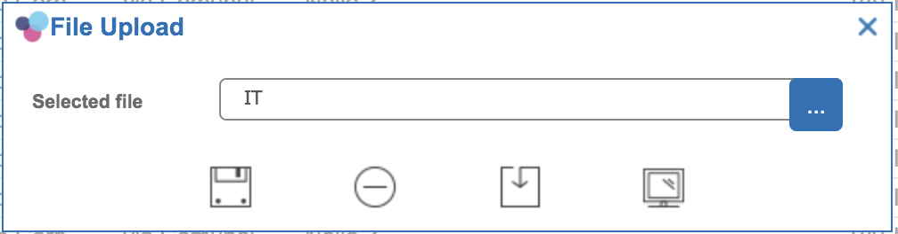
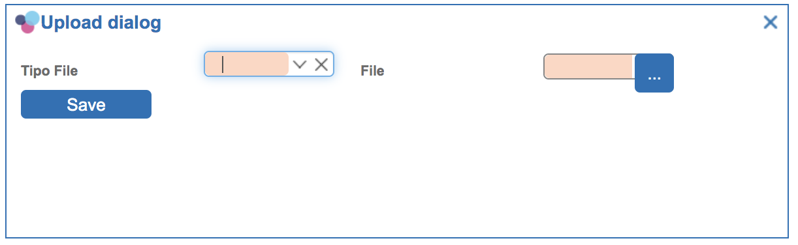
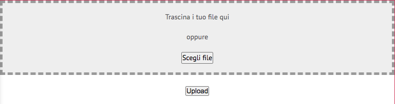
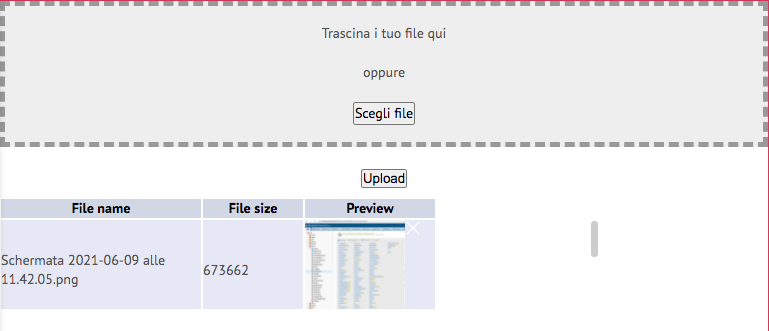

# Uploading files

The easiest way to upload files through platform is using the built-in functionalities available at grid and form level: you have just to define a "**File path**" or "**File image**" type column or control and bound to it a directory id and Platform will manage the rest. When showing a grid/form containing such a field, Platform will provide a standard popup window used to:

* upload a file
* download a file (previously uploaded)
* preview a file (previously uploaded)



Both for a grid or a form, you have to&#x20;

* choose the right column/control type: **File Image** or **File Path**
* select a directory id
* optionally, fill in the advanced property **File Type**, with a list of allowed mime types separated by a comma (e.g. "image/jpg,image/png")

In case you need more freedom when working with files to upload, there are additional javascript method available, described in the following sections.

## Upload a file, starting from an application event

Application events are linked to client-side javascript actions: you can listen to saving events, button click events or any other. You can use a **client-side javascript action** to invoke a **built-in javascript function** provided by Platform, through which you can manage a file upload.

**Syntax**

```
uploadFile(
  title,
  enabled,
  fileName,
  dirId,
  beforeUploadCallback,
  afterUploadCallback,
  errorOnUploadCallback,
  additionalSettings
);
```

| Argument              | Description                                                                                                                                                                                                                                                                                                                                                                                                  |
| --------------------- | ------------------------------------------------------------------------------------------------------------------------------------------------------------------------------------------------------------------------------------------------------------------------------------------------------------------------------------------------------------------------------------------------------------ |
| title                 | Popup window title; you can define here a "translation entry" and set its translation for each supported language in the Translation functionality, by adding custom translations (Insert button) and fill in the Entry column with the same value reported here                                                                                                                                             |
| enabled               | true: upload button is enabled, false: upload button is disabled                                                                                                                                                                                                                                                                                                                                             |
| fileName              | file name to set in the input field; if it is not empty, then a "Download" and "Preview" buttons are shown too                                                                                                                                                                                                                                                                                               |
| dirId                 | directory id on the server side where saving the file to upload                                                                                                                                                                                                                                                                                                                                              |
| beforeUploadCallback  | <p>callback function invoked just before the uploading; format:</p><p></p><p>function({ filename: "...",field: ... }) { </p><p>  return true|false </p><p>} </p><p></p><p>false can block the uploading. </p><p></p><p>You can change the file name by working on the "<strong>filename</strong>" argument.</p><p>You can use the "<strong>field</strong>" input attribute to check out the file length.</p> |
| afterUploadCallback   | <p>callback function invoked after the uploading; format: </p><p></p><p>function({ filename: "....", success: true|false, message: "..." }) </p><p></p><p>The popup window is automatically closed just before this callback is invoked</p>                                                                                                                                                                  |
| errorOnUploadCallback | <p>callback function invoked in case of errors on uploading; format: </p><p></p><p>function({ error: "..." })</p><p></p><p>The popup window is automatically closed just before this callback is invoked</p>                                                                                                                                                                                                 |
| additionalSettings    | contains an optional js object; more details are reported below.                                                                                                                                                                                                                                                                                                                                             |

The optional "additionalSettings" attribute can be filled with a javascript object, used to provide additional settings, expressed as attributes. Supported attributes within this object are:

* acceptMimes: "image/jpg,image/.png", i.e. a list of mime types separated by a comma (,)
* encriptAttachments: true|false
* panelId: ...
* okButtonText: "..." - text to set for the Ok button
* okButtonTooltip: "..." - tooltip to set for the Ok button
* downloadButtonText: "..." - text to set for the Download button
* downloadButtonTooltip: "..." - tooltip to set for the Download button
* previewButtonText: "..." - text to set for the Preview button
* previewButtonTooltip: "..." - tooltip to set for the Preview button
* uploadFileLabel: "..." - text to the for the label to the left of the File input field
* buttonsOnWindow: false|true - flag used to move the buttons at window level (centered) rather than at form level (the default)
* hideDownloadButton: true|false - flag used to hide the Download button
* hidePreviewButton: true|false - flag used to hide the Preview button

Moreover, there are a few CSS classes available for most of the components included in the window:

* uploadFile-downloadButton - CSS class name set for the Download button
* uploadFile-previewButton - CSS class name set for the Preview button
* uploadFile-okButton - CSS class name set for the Ok button
* uploadFile-form - CSS class name set for the form panel within the window
* uploadFile-label - CSS class name set for the label to the left of the file input field
* uploadFile-file - CSS class name set for the file input field
* uploadFile-window - CSS class name set for the whole window


**Note**: this function can be invoked anywhere on the application UI; however, you cannot customize the content of the window, for example by adding additional input fields, specific to your UI. If you need to customize the upload popup window, you'd better use the next function.

## Upload a file, starting from an editable panel

In case you need to customize completely the content of the popup window hosting your file to upload, you can define a Platform window containing a Platform **Editable Panel,** where you can include any type of input fields. The only constraint is to include also a **File Type Field**, available only with Editable Panels.

#### Filtering upload content

Optionally, you can fill in the advanced property **File Type**, with a list of allowed mime types separated by a comma (e.g. "image/jpg,image/png").

#### Multiple upload

Optionally, you can also select the "**Multiple Upload**" checkbox column, if you want to let the end user select multiple files at one time and upload all of them in a unique HTTP request.

#### Customizing upload file field

Such a special field is composed of a readonly text field containing the file name to upload and a button used to open the operating system file selection window to select the file to upload. These field provides CSS classes having this format:

> x-form-text x-form-field fileuploadfield-\<panelid>-\<fielAttribute> x-form-file-text x-form-invalid
>
> x-btn x-form-file-btn x-form-file-btn-fileuploadfield-\<panelid>-\<fieldAttribute> x-btn-noicon

The first CSS class can be used to customize the readonly text field, whereas the second one to customize the button.



Once setting up the popup window, you can add a component event to a button, in order to start the uploading process, through the **uploadFileFromForm** function.&#x20;

You can include in this process also additional information to pass forward to the server-side. More precisely, the upload process consists of:

* required input controls checking: in case there is one of more input fields declared mandatory and not filled, the process is interrupted and a warning message is prompted
* the selected file is sent to the server and saved in the specified directory id; at the same time, additional information is also passed forward to the server, where a server-side javascript action is invoked as long as the file has been saved and all input data is passed forward to this action

**Syntax**

```
var ok = uploadFileFromForm(formPanel,actionId,dirId,settings,additionalSettings);
```

| Argument           | Description                                                                                                                                                                                                                                                                                                                                                                                                                                                                                                                                                                                 |
| ------------------ | ------------------------------------------------------------------------------------------------------------------------------------------------------------------------------------------------------------------------------------------------------------------------------------------------------------------------------------------------------------------------------------------------------------------------------------------------------------------------------------------------------------------------------------------------------------------------------------------- |
| formPanel          | Editable panel variable (e.g. formPanelxxx), used to extract all input values                                                                                                                                                                                                                                                                                                                                                                                                                                                                                                               |
| actionId           | <p>id of the server-side javascript action to invoke; this action would receive in input all field values, through the "vo" input variable, where each field value is indexed by its attribute name:</p><p>{</p><p>  inputfieldAttributeName1: "....",</p><p>  inputfieldAttributeName2: "....",</p><p>  ...</p><p>  fileName: "...", // original file name</p><p>  appId: "...", </p><p>  actionId: ..., </p><p>  dirId: ..., </p><p>  type: "FILE_PATH_FIELD",</p><p>  applicationId: "...", </p><p>  unzip: "N",</p><p>  optionalFileName: "..." // file name renamed</p><p>}</p><p></p> |
| dirId              | directory id where the file must be saved; such a directory can be a Platform server directory or a bucket in GCS                                                                                                                                                                                                                                                                                                                                                                                                                                                                           |
| settings           | <p>optional: can be null; if set, it is a js object containing additional settings:</p><p></p><p></p>                                                                                                                                                                                                                                                                                                                                                                                                                                                                                       |
| additionalSettings | optional: can be null: if set, it contains pars/vals to pass forward to the server-side js action                                                                                                                                                                                                                                                                                                                                                                                                                                                                                           |

Settings can contain something like:

| <p>settings: {</p><p>  autoDefineUploadFileName: true|false,</p><p>   // true to auto-rename file according to this policy: a.pdf -> a_12345566.pdf</p><p></p><p>  beforeUploadCallback: function({ filename: "..." ) {...},  </p><p>  // callback used to define an ad hoc file renaming policy</p><p></p><p>  afterUploadCallback: function({ success: true|false, message: "...", fileName: "..." }) {...}, </p><p>  // callback invoked at the end of the uploading process</p><p></p><p> errorOnUploadCallback: function({ error: "..." }) {...}</p><p>  // callback invoked in case of errors during the uploading process</p><p>}</p> |
| -------------------------------------------------------------------------------------------------------------------------------------------------------------------------------------------------------------------------------------------------------------------------------------------------------------------------------------------------------------------------------------------------------------------------------------------------------------------------------------------------------------------------------------------------------------------------------------------------------------------------------------------- |

Example of code which can be included in the client-side javascript action bound to a button click event, in order to start the uploading process:

```
uploadFileFromForm(
    formPanelxxx, // Editor Panel variable
    yyy, // actionId
    zzz, // dir id
    {
        autoDefineUploadFileName: true
    },
    {
        myId: 123 // additional parameters to pass forward to the server side action
    }
);
```

#### Server-side javascript action

On the server side, there must be a javascript action to invoke when passing forward file(s) and data. The "uploadFileFromForm" utility function would pass forward both and at the time the action starts, the uploaded file(s) are already saved on the file system, within the specified directory id.

On the "**vo**" javascript object available in input by the action, there is all data passed forward and a few additional attributes:

* **filenames**, a String containing the list of file names uploaded, separated by a comma
* **filename**, a String reporting the first file uploaded; do not use this attribute in case you have configured the editable panel to work with multiple files
* **dirId** - the numeric identifier of the directory where files have been saved

You can manage the uploaded files (e.g. to move them to a final destination) starting from the "filenames" attribute.

## Download an uploaded file

Once a file has been uploaded, the easiest way to download it is through the grid/form panel from which it has been uploaded (see first section in this web page).

Anyway, it is possible to customize the download process and attach it in any part of the application UI, through the client-side javascript function provided by Platform:

```
downloadFile(fileName,dirId)
```

You need to provide to this function the file name for the file to download and its location.

**Examples:**

```
// in case of a grid having one file for each row
var selectedRow = gridxxx.getSelectionModel().getSelected();
var vo = selectedRow.data;
downloadFile(
  vo.fileName, // e.g. the attribute name containing the file name
  dirId // provided externally
);
```

```
// in case of a form having a file linked to it
var record = formxxx.getForm().record;
downloadFile(
  record.fileName, // e.g. the attribute name containing the file name
  dirId // provided externally
);
```

**Note**: pay attention in case you are storing files in GCS; in such a scenario, the directory id only identifies the bucket name, not the relative path of the file, which must be saved along with the file name itself.

## Preview an uploaded file

Once a file has been uploaded, the easiest way to show it again is through the grid/form panel from which it has been uploaded (see first section in this web page).

Anyway, it is possible to customize the preview process and attach it in any part of the application UI, through the client-side javascript function provided by Platform:

```
previewFile(fileName,dirId,settings)
```

You need to provide to this function the file name for the file to download and its location.

**Examples:**

```
// in case of a grid having one file for each row
var selectedRow = gridxxx.getSelectionModel().getSelected();
var vo = selectedRow.data;
previewFile(
  vo.fileName, // e.g. the attribute name containing the file name
  dirId, // provided externally
  { // this argument can be omitted
    width: "100%", // optional
    height: 400, // optional
    title: "Preview" // optional
  }
);
```

```
// in case of a form having a file linked to it
var record = formxxx.getForm().record;
previewFile(
  record.fileName, // e.g. the attribute name containing the file name
  dirId, // provided externally
  { // this argument can be omitted
    width: "100%", // optional
    height: 400, // optional
    title: "Preview" // optional
  }
);
```

**Note**: pay attention in case you are storing files in GCS; in such a scenario, the directory id only identifies the bucket name, not the relative path of the file, which must be saved along with the file name itself.

**Note**: not all file formats can be showed as a preview; it depends on the browser plugins/extensions installed; it can work for most of the image formats, PDF (if Acrobat reader has been installed), text files, but it is unlikely that it can work for Office documents.

## Upload a file, starting from a multiple file upload panel

Since 6.0.1 version there is a new panel, which can be included in a window as any other panel type, which contains:

* a drag'n drop area where a user can drop files selected from his local file system
* a selection button used to access the default files window and select multiple files from the local file system, as an alternative to the previous approach
* an upload button to upload all these files to the standard server-side web service and then invoke a server-side javascript action to process the received files



Optionally, it is also possible to show an additional area within the same panel, used to show all selected files and see:

* file name
* file size
* a file preview, in case the file is an image



In order to use this panel, a Custom Panel must be created and within the javascript function to specify, create such a new panel:

```
function getMyMultipleUploadPanel() {
  var p = new Tinet.MultipleUploadPanel({
      actionId: 149,
      dirId: 9,
      showList: true,
      afterUpload: function() {}
  });
  return p;
}
```

**Syntax**

| Argument    | Description                                                                                  |
| ----------- | -------------------------------------------------------------------------------------------- |
| actionId    | mandatory attribute: the action on the server-side to invoke after uploading files           |
| dirId       | mandatory attribute: where saving files on the server                                        |
| showList    | true/false: used to show the additional area containing the list of selected files to upload |
| afterUpload | an optional callback, invoked by Platform after a successful upload                          |

You can customize the theme, starting from the default settings defined in app.css


