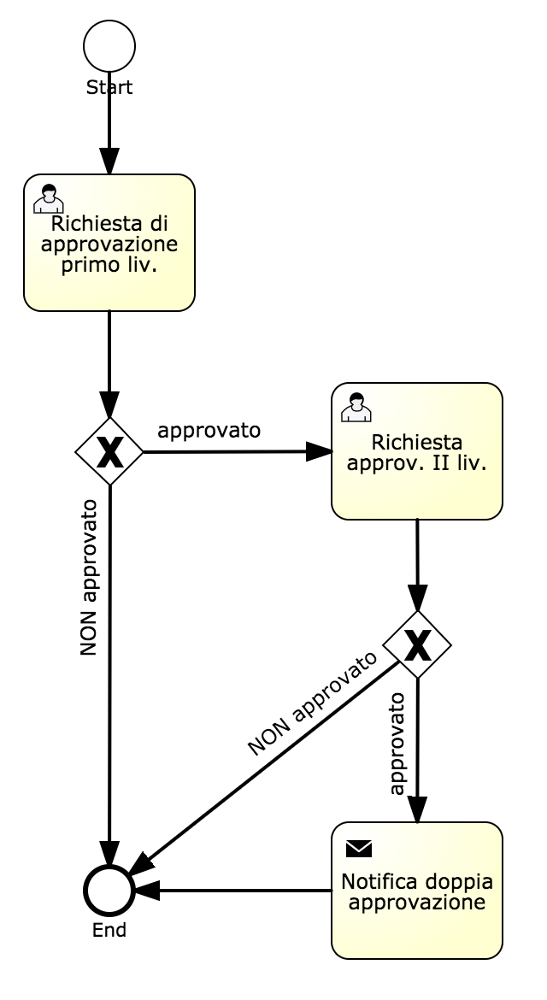

# Activiti

## Activiti BPM - Start a process

Method used to start a process and get back a process instance id.

**Syntax**:

```javascript
var responseObj = utils.startActivitiProcess(
  String appId, 
  String processDefinitionId, 
  Map params, 
  Map processVariables
);
```

**Description**:

| Argument | Description |
| :--- | :--- |
| appId | application id having the process defined internally |
| processDefinitionId | process id defined when creating the workflow though the Activiti Web Designer |
| params | optional parameters which can override the default ones; for example there can be attributes like "username" and "password" which can be used instead of the current logged user, when starting the process |
| processVariables | input parameters defined for the Start task within the process definition |

The responseObj javascript object can contain:

* success - boolean flag reporting whether the process was started successfully
* id  - the process instance id related to the instance just started, in case of success = true
* msg - error message, in case of success = false

## Activiti BPM - Complete a manual task

Method used to start and complete a manual task for the current logged user.

**Syntax**:

```javascript
var responseObj = utils.completeActivitiTask(
  String processInstanceId, 
  Map params, 
  Map processVariables
);
```

**Description**:

| Argument | Description |
| :--- | :--- |
| processInstanceId | instance id related to a process started |
| params | optional parameters which can override the default ones; for example there can be attributes like "username" and "password" which can be used instead of the current logged user, when starting the process |
| processVariables | input parameters to pass forward to the manual task to start/complete |

The responseObj javascript object can contain:

* success - boolean flag reporting whether the process was started successfully
* msg - error message, in case of success = false


## Activiti BPM - Get process descriptor

Method used to get the description, in JSON format, of the static definition of a process.

Such a description contains all objects defined in a process: user tasks, automatic tasks \(service/script tasks\), gateways \(if, fork, join\), start/ends events.

**Syntax**:

```javascript
var json = utils.getActivitiProcessAsJson(
  processId, 
);
```

**Description**:

| Argument | Description |
| :--- | :--- |
| processId | identifier of the process  |

The  response is a String representing the process descriptor, expressed in JSON format. An exception is fired in case of errors or null if the processed has not been found.

The JSON has the following content:

```javascript
[{
	"name": "Start",
	"id": "startevent1",
	"type": "startEvent",
	"targets": ["T1"]
}, {
	"sources": ["T1"],
	"name": "End",
	"id": "endevent1",
	"type": "endEvent"
}, {
	"sources": ["startevent1"],
	"candidateUsers": "ADMIN",
	"name": "ABC",
	"id": "T1",
	"type": "userTask",
	"targets": ["endevent1"]
}]
```

By and large, the result is always a list, where each js object is related to an element of the process \(a task, a gateway, an event, etc\); the elements in the list are not reported in a specific order.

Each js object always contains the following attributes:

* **name** - the task name
* **id** - the task id, helpful to refer the task in the rest of the application or to sort the task reference in a database table
* **type** - the element type; if can be: **startEvent, endEvent, userTask, serviceTask, scriptTask, parallelGateway, inclusiveGateway**, **callActivity** \(in case of an invocation of a sub-process\), **boundaryEvent** \(a timer linked to a userTask\)
* **sources** - list of ids related to all elements having a link starting from them and arriving in the current element \(predecessors\)
* **targets** - list of ids related to all elements having a link whose origin is the current element \(destinations\)

Additionally, according to the **type**, there can be other attributes:

* **candidateUsers, candidateGroups, assignee** - for a userTask element; they can be null even for userTask elements
* **dueDate** - for a userTask element; **it** can be null even for userTask elements
* **calledElement** - process id related to the sub-process to invoke, in case of a callActivity type element
* **timeDuration** - duration of a timer, in case of a boundaryEvent type element

**Example**:



```javascript
[{
	"name": "Start",
	"id": "startevent1",
	"type": "startEvent",
	"targets": ["T1"]
}, {
	"sources": ["T3", "IF1", "IF2"],
	"name": "End",
	"id": "endevent1",
	"type": "endEvent"
}, {
	"sources": ["startevent1"],
	"candidateGroups": "1",
	"name": "Richiesta di approvazione primo liv.",
	"id": "T1",
	"type": "userTask",
	"targets": ["IF1"]
}, {
	"sources": ["T1"],
	"id": "IF1",
	"type": "exclusiveGateway",
	"targets": ["endevent1", "T2"]
}, {
	"sources": ["IF1"],
	"candidateGroups": "2",
	"name": "Richiesta approv. II liv.",
	"id": "T2",
	"type": "userTask",
	"targets": ["IF2"]
}, {
	"sources": ["IF2"],
	"name": "Notifica doppia approvazione",
	"id": "T3",
	"type": "serviceTask",
	"targets": ["endevent1"]
}, {
	"sources": ["T2"],
	"id": "IF2",
	"type": "exclusiveGateway",
	"targets": ["endevent1", "T3"]
}]
```

Note: to quickly figure out how a process definition is, you can use the following utility URL from browser:

```javascript
http://localhost:8280/wag/activiti/getProcessAsJson?appId=<yourappId>&id=>yourprocessId>
```

## Activiti BPM - How to get the preview image for a process definition

URL

```javascript
https://<yourhostandport/<platformwebcontext>/activiti/process-definitions-diagram?applicationId=...&appId=...&id=...
```

where id is the full key for a process.

Example: 

```javascript
var id = "SIN00000_00000_M7:4:3251";
```

It can be defined by concatenating the following content:

* "SIN" constant string
* company id
* "\_" constant string
* company id
* "\_" constant string
* process id
* ":" constant string
* last process version
* ":" constant string
* deployment id for the specified process id

The information above can be easily retrieved starting from the process list web service or by invoking the javascript server-side utility method getActivitiLastVersionProcessId.

The same value can retrieved also by invoking the standard Platform web service:

```javascript
http://<yourhostandport/<platformwebcontext>/activiti/getLastVersionProcessId?appId=...&id=...
```

which returns the following JSON string:

```javascript
{"success":true,"id":"..."}
```

## Activiti BPM - Get the full key for a process

A process id is simply a code; when referring a process, it is often needed to specify the full key, composed of version and deployment id.

It can be retrieved by invoking the standard Platform web service:

```javascript
http://<yourhostandport/<platformwebcontext>/activiti/getLastVersionProcessId?appId=...&id=...
```

which returns the following JSON string:

```javascript
{"success":true,"id":"..."}
```


## Activiti BPM - How to get the preview image for a process instance execution

URL

```javascript
https://<yourhostandport/<platformwebcontext>/activiti/process-instances-diagram?applicationId=...&appId=...&processInstanceId=...
```

## Activiti BPM - How to get the preview image for a process instance execution

URL

```javascript
https://<yourhostandport/<platformwebcontext>/activiti/process-instances-diagram?applicationId=...&appId=...&processInstanceId=...
```

The result is something like:

```javascript
{
	"resultSetLength": 1,
	"start": 0,
	"sort": "id",
	"order": "asc",
	"size": 1,
	"valueObjectList": [{
		"assignee": null,
		"createTime": "2020-05-15T14:41:13CEST",
		"delegationState": null,
		"description": null,
		"dueDate": "2020-05-15T14:42:13CEST",
		"executionId": "5412",
		"id": "5415",
		"name": "Approva",
		"owner": null,
		"parentTaskId": null,
		"priority": 50,
		"processDefinitionId": "SIN00000_00000_m9:6:5323",
		"processInstanceId": "5409",
		"taskDefinitionKey": "sid-11928038-4C44-4298-B539-4EBB433190F0",
		"formResourceKey": null,
		"subTaskList": [],
		"identityLinkList": [],
		"attachmentList": []
	}]
}
```

## Activiti BPM - How to get the list of assigned tasks for the current user

URL

```javascript
https://<yourhostandport/<platformwebcontext>/activiti/tasks?applicationId=...&appId=..&assignee=<currentuser>
```

The result is something like

```javascript
{
	"resultSetLength": 1,
	"start": 0,
	"sort": "id",
	"order": "asc",
	"size": 1,
	"valueObjectList": [{
		"assignee": "ADMIN",
		"createTime": "2020-05-13T17:29:52CEST",
		"delegationState": null,
		"description": null,
		"dueDate": null,
		"executionId": "5199",
		"id": "5215",
		"name": "Task manuale 2",
		"owner": null,
		"parentTaskId": null,
		"priority": 50,
		"processDefinitionId": "SIN00000_00000_m9:4:5198",
		"processInstanceId": "5199",
		"taskDefinitionKey": "sid-FBB5F9C2-AE6C-483E-B4DE-BC6B3C9724E3",
		"formResourceKey": null,
		"subTaskList": [],
		"identityLinkList": [],
		"attachmentList": []
	}]
}
```


## Activiti BPM - How to assign a task to a user

URL

```javascript
https://<yourhostandport/<platformwebcontext>/activiti/task-assignee?applicationId=...&appId=...&taskId=<taskInstanceId>&assignee=<anotheruser>
```

where the taskInstanceId is the value for the id attribute in the  assignable tasks list reported in the previous section.

The same operation can be executed also within a server-side javascript action, through the function:

```javascript
utils.setTaskAssignee(String taskInstanceId,String assignee);
```

## Activiti BPM - How to get the list of running tasks 

URL

```javascript
https://<yourhostandport/<platformwebcontext>/activiti/enquiryTasks?appId=...
```

You can add any number of additional filters to get a subset of all running tasks, like assignee, candidateUsers, candidateGroups, process id, process instance id, etc.

The whole list of available filters is reported here:



The result is something like:

```javascript
{
	"resultSetLength": 1,
	"start": 0,
	"sort": "id",
	"order": "asc",
	"size": 7,
	"valueObjectList": [{
		"id": "5638",
		"url": "http://localhost:8080/activiti-rest/service/runtime/tasks/5638",
		"owner": null,
		"assignee": "DEMO",
		"delegationState": null,
		"name": "Scelta",
		"description": null,
		"createTime": "2020-05-20T09:59:10.000+0000",
		"dueDate": "2020-05-20T10:09:10.000+0000",
		"priority": 50,
		"suspended": false,
		"taskDefinitionKey": "T1",
		"parentTaskId": null,
		"parentTaskUrl": null,
		"executionId": "5631",
		"executionUrl": "http://localhost:8080/activiti-rest/service/runtime/executions/5631",
		"processInstanceId": "5631",
		"processInstanceUrl": "http://localhost:8080/activiti-rest/service/runtime/process-instances/5631",
		"processDefinitionId": "SIN00000_00000_m11:2:5622",
		"processDefinitionUrl": "http://localhost:8080/activiti-rest/service/repository/process-definitions/SIN00000_00000_m11%3A2%3A5622",
		"variables": []
	}]
}
```

The same operation can be executed also within a server-side javascript action, through the following function:

```javascript
var json = utils.enquiryTasks(HashMap pars);
```

 

## Activiti BPM - How to get the list of tasks assigned to other users where the specified user is a candidate

URL

```javascript
https://<yourhostandport/<platformwebcontext>/activiti/getInvolvedNotAssignedTasks?appId=...&username=...
```

You can add any number of additional filters to get a subset of all running tasks, like process id, process instance id, task id, etc.

The whole list of available filters is reported here:

[https://www.activiti.org/5.x/userguide/\#restTasksGet](https://www.activiti.org/5.x/userguide/#restTasksGet)

The returned list of tasks only includes tasks already assigned to other users, but which have the specified username as a candidate for those tasks.

The result is something like:

```javascript
{
	"resultSetLength": 1,
	"start": 0,
	"sort": "id",
	"order": "asc",
	"size": 7,
	"valueObjectList": [{
		"id": "5638",
		"url": "http://localhost:8080/activiti-rest/service/runtime/tasks/5638",
		"owner": null,
		"assignee": "DEMO",
		"delegationState": null,
		"name": "Scelta",
		"description": null,
		"createTime": "2020-05-20T09:59:10.000+0000",
		"dueDate": "2020-05-20T10:09:10.000+0000",
		"priority": 50,
		"suspended": false,
		"taskDefinitionKey": "T1",
		"parentTaskId": null,
		"parentTaskUrl": null,
		"executionId": "5631",
		"executionUrl": "http://localhost:8080/activiti-rest/service/runtime/executions/5631",
		"processInstanceId": "5631",
		"processInstanceUrl": "http://localhost:8080/activiti-rest/service/runtime/process-instances/5631",
		"processDefinitionId": "SIN00000_00000_m11:2:5622",
		"processDefinitionUrl": "http://localhost:8080/activiti-rest/service/repository/process-definitions/SIN00000_00000_m11%3A2%3A5622",
		"variables": []
	}]
}
```

The same operation can be executed also within a server-side javascript action, through the following function:

```javascript
var json = utils.getInvolvedNotAssignedTasks(HashMap pars,String username);
```

 


