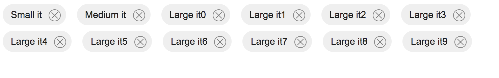
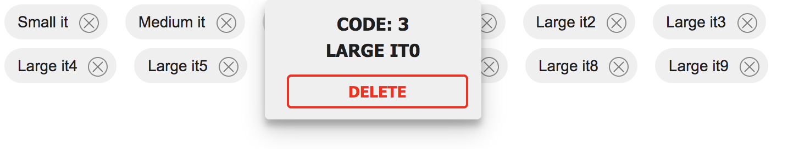

# Chips panel

Since version 6.0.1 of Platform, there is a new type of panel: the ChipsPanel, which can be used to render a list of chips. This panel is based on ExtJS and completely embeddable in already existing windows.

There are 2 ways to create it:

* in version 6.0.1 it is possible to create an instance of this panel only programmatically, using the object **Tinet.ChipsPanel**
* starting from version 6.0.2, it is also possible to use the wizard for window/panels creation and configure this panel graphically

A Chips panel can render a series of chips on a "column layout", i.e. from left to right and from top to bottom, according to the available space.

Each chip is composed of a description and an X button, used to remove the chip from the panel.



When clicking on the chip, a tooltip window is shown and used to report additional data about the chip, like the code and description associated to the chip and a "remove" button, used to remove the chip from the panel.



Each chip contains behind the scene a javascript object, which be accessed as "**vo**" attribute in the chip object. The unique identifier of the chip (**valueField** property) and the description to show in the chip (**displayField** property) must be part of this javascript object.

A Tinet.ChipsPanel has the following syntax:

```
var myChipsPanel = new Tinet.ChipsPanel({
    listeners: {
      afterDetail: function(vo) {},
      afterRemove: function(vo) {},
      beforeRemove: function(vo) { return true|false },
      beforeDetail: function(vo) { return true|false },
    },
    compId: xyz, // optional, if specified, it represents the remote business component to invoke in order to get the list of data
    panelId: xyz, // optional, if specified, it represents the panel connected to the remote business component to invoke in order to get the list of data
    valueField: "...",  // optional, if not specified, it is autofilled with "id"
    displayField: "...", // mandatory
    translation: true|false, // optional: if true, a translation would be used; example: if displayField="descriptioIt", translation=true, languageAppId="EN" then the real attribute would be "descriptionEn" 
    chipTooltip: "", // optional; contains HTML and attribute values, each expressed as {attribute}; example: "<b>Code: {code}</b><br><span>{description}</span>
    chipStyle: {} // optional;
  });
```

**Syntax**

| Attribute              | Description                                                                                                                                                                                                                                                                                                                                                                                                                                                                                                                                           |
| ---------------------- | ----------------------------------------------------------------------------------------------------------------------------------------------------------------------------------------------------------------------------------------------------------------------------------------------------------------------------------------------------------------------------------------------------------------------------------------------------------------------------------------------------------------------------------------------------- |
| listeners.afterDetail  | optional callback, invoked each time the end user clicks on a chip                                                                                                                                                                                                                                                                                                                                                                                                                                                                                    |
| listeners.afterRemove  | optional callback, invoked each time the end user clicks on the X button, within the chip, in order to remove it                                                                                                                                                                                                                                                                                                                                                                                                                                      |
| listeners.beforeRemove | optional callback, invoked each time the end user clicks on the X button: this callback can interrupt the removal of the chips, if a "return false" is returned                                                                                                                                                                                                                                                                                                                                                                                       |
| listeners.beforeDetail | optional callback, invoked each time the end user clicks on a chip: this callback can interrupt the opening of the chip tooltip, if a "return false" is returned                                                                                                                                                                                                                                                                                                                                                                                      |
| compId                 | this is an optional attribute: if specified, the ChipsPanel will fetch data from a remote business component for lists and use this data to fill in the panel with a chip for each element in the returned list. If not specified, it is up to the programmer to fill in the panel, either using the "load" method (add multiple chips at the same time and remove the previous ones) or through the "addChip" method (add a single chip to the already existing chips)                                                                               |
| panelId                | this is an optional attribute: it must be filled with the current panel id ONLY IF the "compId" attribute has been specified. Moreover, if the application has activated the checking of roles on the server side, you have also to include the current compId in the list of compIds allowed to be invoked by the client.                                                                                                                                                                                                                            |
| valueField             | mandatory attribute used to define the unique identifier for the chip, among the attributes stored within the chip                                                                                                                                                                                                                                                                                                                                                                                                                                    |
| displayField           | mandatory attribute used to show it as the chip description                                                                                                                                                                                                                                                                                                                                                                                                                                                                                           |
| translation            | optional flag; if set to true, Platform will attempt to show within the chip a description coming from an attribute which can be "displayField" if this is related to the right language id used by the current user (e.g. displayField = "descriptionIt" for language id = "IT") or an alternative attribute reckoned starting from the prefix of "displayField" and suffix coming from the current language id (e.g. displayField = "descriptionIt" with language id = "EN" would lead to use as description the value of "descriptionEn" attribute |
| chipTooltip            | <p>optional attribute: it contains HTML and attribute values, each expressed as {attribute}; example: </p><p><strong></strong></p><p>&#x3C;b>Code: {code}&#x3C;/b>&#x3C;br/><br>{description}</p>                                                                                                                                                                                                                                                                                                                                                     |
| chipStyle              | optional attribute: it can contains additional CSS settings to pass forward when rendering a chip                                                                                                                                                                                                                                                                                                                                                                                                                                                     |


The Tinet.ChipsPanel inherits from Ext.Panel and you can also use any other settings coming from Ext.Panel, including its methods.

Apart from that, ChipsPanel provides also a few utility method, described below:

| Method                                                             | Description                                                                                                                                                              |
| ------------------------------------------------------------------ | ------------------------------------------------------------------------------------------------------------------------------------------------------------------------ |
| removeAll()                                                        | Remove all chips added to the panel; this method is also invoked automatically each time the "load" method is called                                                     |
| addChip(vo,opts)                                                   | vo is a javascript object, to embed in the chip and including the attributes referred by "valueField", "displayField" and any other attribute referred in  "chipTooltip" |
| removeChip(vo)                                                     | remove a chip from the panel, starting from the vo embedded on it                                                                                                        |
| <p><br>getChipByItemId(itemId)</p>                                 | get the chip (UI component) starting from its itemId property                                                                                                            |
| getChipByValue(value)                                              | get the chip (UI component) starting from the unique identifier (valueField)                                                                                             |
| getDataByItemId(itemId)                                            | get the vo embedded in a chip, starting from the chimp itemId                                                                                                            |
| getDataByValue(value)                                              | get the vo embedded in a chip, starting from its unique identifier (valueField)                                                                                          |
| getChips()                                                         | get the list of chips currently shown (list of UI components)                                                                                                            |
| load()                                                             | load all data from the remote business component; in order to use this method, both panelId and compId panel properties must be defined                                  |
| <p>load({  </p><p>  vos: [...], </p><p>  opts: {...} </p><p>})</p> | load all data from a local list of objects; "opts" is optional and applied to all items                                                                                  |


### Creating a ChipsPanel programmatically

You can use a javascript event and use it to create an Ext.Window containing a ChipsPanel object or you can include this panel in an already existing or new window. In the latter case, you can use the Window creation wizard and choose the Custom panel or open an already existing window and again add a Custom panel.

When defining the Custom panel, you have to refer a javascript global function which must get back the ChipsPanel. Consequently, you have also to define such a function in some .js file included in the web context or in the starting javascript action bound to the application.

An example of this function is reported below:

```
function getMyChipsPanel() {
    var chipsPanel = new Tinet.ChipsPanel({
    border: false,
    listeners: {
     afterDetail: function(vo) {},
     afterRemove: function(vo) {},
     beforeRemove: function(vo) { return true },
     beforeDetail: function(vo) { return true },
    },
    panelId: ...,
    compId: ...,
    valueField: "progId",  // optional, if not specified, it is autofilled with "id"
    displayField: "descriptionIt", // mandatory
    translation: true, // optional: if true, a translation would be used; example: if displayField="descriptionIt", translation=true, languageAppId="EN" then the real attribute would be "descriptionEn" 
    chipTooltip: "<b>Code: {progId}</b><br><span>{descriptionIt}</span>", // optional; contains HTML and attribute values, each expressed as {attribute}; example: "<b>Code: {code}</b><br><span>{description}</span>
    chipStyle: {}
  });
  chipsPanel.load();
  return chipsPanel;
}
```

In this example the Chips panel is filled in through the "**load**" method which will invoke asynchronously a server-side business component for lists and use the objects contained in the response to create chips. Each object must contain the attributes defined int he ChipsPanel definition, i.e. valueField and displayField (and also the ones referred int he chipsTooltip attribute, if specified).

An alternative way to fill in the panel is through the load method, which can accept a list of objects and optionally also optional CSS settings:

```
var opts = null;

chipsPanel.load({
  vos: [{ 
    progId: 123,
    descriptionIt: "UnDueTre",
    descriptionen: "OneTwoThree"
  },
  ...
  ],
  opts
});
```

Finally, you can add chips through the "addChip" method:

```
var opts = null;

chipsPanel.addChip({
    progId: 123,
    descriptionIt: "UnDueTre",
    descriptionen: "OneTwoThree"
}, opts);
```


### Customizing the chips theme

You can customize the chimps theme through CSS. All default settings are stored in app.css default file, in the section named "chips".

When overriding it, you can change for example the tooltip window width, colors, borders, etc.

