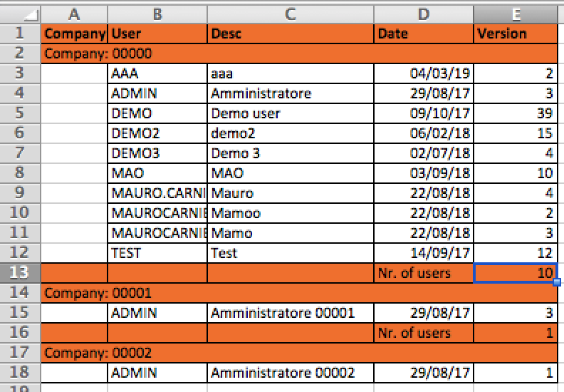

# Excel File

## Reading an xls file stored in the specified path

Read up to 10000 rows x 1000 columns from the xls file stored in the specified path and get back the content of a specific folder

**Syntax**

```javascript
var list = utils.getXlsContent(String dirId,String fileName,int sheetIndex,int fromRow,String... attributeNames);
```

**Details**

```
 dirId: path identifier
  fileName name of the xls file
 sheetIndex sheet index inside the spreadsheet, starting from 0
 fromRow the content will be read starting from the specified row index (the first row has index 0)
 attributeNames, list of attributes, assigned to each column, starting from leftmost column to the right
 return a list of js objects, where each object is expressed as a set of couples &lt;attributename, related value&gt;
```

Values stored in each js object can be accessed as: object.get("attributeName")

## Export data from database in xlsx format

Starting from a SQL query and bind variables, generate an xlsx file.

It is possible to customize this file in a variety of different ways:

* defining the sheet name
* adding new sheets to an already existing xlsx (used as template)
* adding a row at the beginning, reporting the column headers
* customizing horizontal alignment, column width, background/foreground color for each cell (both for header and data rows), font (name, size, bold/italic/underline), data format (for dates and numbers)
* breaking up rows in sections, according to the value of one column (grouping data) and adding an header row at the beginning of each section; optionally, a footer row can be included as well, where specifying Excel functions (es. SUM, COUNT, etc.)

**Syntax**

```javascript
var exportedRows = utils.createXLSXFileFromSQLQuery(
        Long templateDirectoryId,
        String templateFileName,
        String sheetName,
        Long outDirectoryId,
        String outFileName,
        Map[] formatHeaderColumns,
        Map[] formatColumns, 
        Map grouping,
        Map additionalSettings,
        Long datastoreId,
        String sqlQuery,
        Object[] pars
);
```

**Details**

| Argument            | Description                                                                                                                                                                                                                                                                                                                                                                                                                                                                                    |
| ------------------- | ---------------------------------------------------------------------------------------------------------------------------------------------------------------------------------------------------------------------------------------------------------------------------------------------------------------------------------------------------------------------------------------------------------------------------------------------------------------------------------------------- |
| templateDirectoryId | can be null; if specified, the xlsx file to create will be generated starting from a copy of an already existing xlsx file to use as a template; such a template file is located in this directory; if not specified, the xlsx file to create will be generated form scratch                                                                                                                                                                                                                   |
| templateFileName    | can be null; this argument must be specified together with "templateDirectoryId: it represents the xlsx file name of the template file to use when creating the new xlsx file                                                                                                                                                                                                                                                                                                                  |
| sheetName           | name for the sheet to create within the xlsx file                                                                                                                                                                                                                                                                                                                                                                                                                                              |
| outDirectoryId      | path where storing the xlsx file                                                                                                                                                                                                                                                                                                                                                                                                                                                               |
| outFileName         | xlsx file to create, within the path specified through "outDirectoryId"                                                                                                                                                                                                                                                                                                                                                                                                                        |
| formatHeaderColumns | can be null: in such a case, there will not be a first header row. If specified, it must be list of javascript objects, where each object is related to the settings of a column header, so it can be used to specify the column header properties, like title, foreground/background color, font (name, size, style), alignment. See below for the allowed values for each property                                                                                                           |
| formatColumns       | can be null: in such a case, each numeric/date column will be formatted automatically; the column width will be automatically defined, starting from the column header name. If specified, it must be list of javascript objects, where each object is related to the settings of a (data) column, so it can be used to specify the (data) column properties, like width, foreground/background color, font (name, size, style), alignment. See below for the allowed values for each property |
| grouping            | can be null; if specified, it allows to break up a rows according to the value of a specific column, used to group rows. Each time a different value for that column is found, an additional row is added to the spreadsheet. Optionally, a footer row can be included as well, helpful to execute Excel formulas, like SUM or COUNT, for example. The "grouping" attribute must be a javascript object containing at least the attribute "fieldName". See below for the whole object content. |
| additionalSettings  | set it to null, since at the moment is not managed                                                                                                                                                                                                                                                                                                                                                                                                                                             |
| datastoreId         | related to the database scheme where executing the SQL query to use to fill in the xlsx file.                                                                                                                                                                                                                                                                                                                                                                                                  |
| sqlQuery            | SQL query to execute                                                                                                                                                                                                                                                                                                                                                                                                                                                                           |
| params              | list of javascript objects representing the values for the bind variables expressed in the "sqlQuery" through ? symbols.                                                                                                                                                                                                                                                                                                                                                                       |

Structure of a javascript object contained in the list of objects composing the "formatHeaderColumns":

| Attribute name | Description                                                                                                                                  |
| -------------- | -------------------------------------------------------------------------------------------------------------------------------------------- |
| title          | header name; it is mandatory                                                                                                                 |
| backColor      | can be null; background color. It must be expressed as a string, among the ones recognized by Excel and reported below in "Supported colors" |
| foreColor      | can be null; foreground color. It must be expressed as a string, among the ones recognized by Excel and reported below in "Supported colors" |
| fontName       | can be null; font name, recognized by Excel, like "Arial", "Courier", ...                                                                    |
| fontSize       | can be null; Font dimension, expressed in points, like 100, 200, etc.                                                                        |
| bold           | can be null; boolean value: if set to true, the title will be set in bold                                                                    |
| italic         | can be null; boolean value: if set to true, the title will be set in italic (corsive)                                                        |
| underline      | can be null; boolean value: if set to true, the title will be underlined                                                                     |
| align          | horizontal alignment; supported values are: "LEFT", "CENTER", "RIGHT", "JUSTIFY"                                                             |

Structure of a javascript object contained in the list of objects composing the "formatColumns":

| Attribute name | Description                                                                                                                                                                                                                                                                                                                                                   |
| -------------- | ------------------------------------------------------------------------------------------------------------------------------------------------------------------------------------------------------------------------------------------------------------------------------------------------------------------------------------------------------------- |
| width          | can be null; column width, expressed in points                                                                                                                                                                                                                                                                                                                |
| backColor      | can be null; background color. It must be expressed as a string, among the ones recognized by Excel and reported below in "Supported colors"                                                                                                                                                                                                                  |
| foreColor      | can be null; foreground color. It must be expressed as a string, among the ones recognized by Excel and reported below in "Supported colors"                                                                                                                                                                                                                  |
| fontName       | can be null; font name, recognized by Excel, like "Arial", "Courier", ...                                                                                                                                                                                                                                                                                     |
| fontSize       | can be null; Font dimension, expressed in points, like 100, 200, etc.                                                                                                                                                                                                                                                                                         |
| bold           | can be null; boolean value: if set to true, the title will be set in bold                                                                                                                                                                                                                                                                                     |
| italic         | can be null; boolean value: if set to true, the title will be set in italic (corsive)                                                                                                                                                                                                                                                                         |
| underline      | can be null; boolean value: if set to true, the title will be underlined                                                                                                                                                                                                                                                                                      |
| align          | horizontal alignment; supported values are: "LEFT", "CENTER", "RIGHT", "JUSTIFY"                                                                                                                                                                                                                                                                              |
| format         | can be null; in case of a column having date type, the format should be "m/d/yy", in case of a numeric column it can be "#,##0.00". See the following link for all supported values: [https://poi.apache.org/apidocs/dev/org/apache/poi/ss/usermodel/BuiltinFormats.html](https://poi.apache.org/apidocs/dev/org/apache/poi/ss/usermodel/BuiltinFormats.html) |

Structure of the javascript object for "grouping":

| Attribute name | Description                                                                                                                                                                                                                                                                                                                                                                                                                                                                                                                   |
| -------------- | ----------------------------------------------------------------------------------------------------------------------------------------------------------------------------------------------------------------------------------------------------------------------------------------------------------------------------------------------------------------------------------------------------------------------------------------------------------------------------------------------------------------------------- |
| fieldName      | field name: mandatory field; it must be one of the fields reported in the SELECT clause                                                                                                                                                                                                                                                                                                                                                                                                                                       |
| showColumn     | can be null; boolean value; if set to false, the column related to "fieldName" will be hidden, since it contains always the same value for all rows in the same section                                                                                                                                                                                                                                                                                                                                                       |
| showValue      | can be null; boolean value; if set to false, the column related to "fieldName" is shown but the value is not reported (empty cell), since it contains always the same value for all rows in the same section                                                                                                                                                                                                                                                                                                                  |
| headerRow      | optional attribute: it is a list of javascript objects, where each object defines a cell to include in the header row added before each section. This object must contains a "title" attribute; optionally it can include all other attributes reported for "formatHeaderColumns"; moreover, it is possible to specify "colSpan" attribute, indicating the number of cells occupied by the current cell. The "title" attribute can contain fixed text and/or values coming from the current record, expressed as \<FIELDNAME> |
| footerRow      | Same as for "headerRow," but used to define the optional footer section. Unlike the "headerRow", the "title" attribute can also contain a formula, always applied to the current section. A formula is expressed as "=FORMULA" or "=FORMULA,COLUMNNAME". For example, if you want to apply a SUM to all cells in the column B, limited to the current section, you can define "=SUM,B"                                                                                                                                        |

List of supported colors, in background/foreground colors:

AQUA , AUTOMATIC , BLACK , BLACK1 , BLUE , BLUE\_GREY , BLUE1 , BRIGHT\_GREEN , BRIGHT\_GREEN1 , BROWN , CORAL , CORNFLOWER\_BLUE , DARK\_BLUE , DARK\_GREEN , DARK\_RED , DARK\_TEAL , DARK\_YELLOW , GOLD , GREEN , GREY\_25\_PERCENT , GREY\_40\_PERCENT , GREY\_50\_PERCENT , GREY\_80\_PERCENT , INDIGO , LAVENDER , LEMON\_CHIFFON , LIGHT\_BLUE , LIGHT\_CORNFLOWER\_BLUE , LIGHT\_GREEN , LIGHT\_ORANGE , LIGHT\_TURQUOISE , LIGHT\_TURQUOISE1 , LIGHT\_YELLOW , LIME , MAROON , OLIVE\_GREEN , ORANGE , ORCHID , PALE\_BLUE , PINK , PINK1 , PLUM , RED , RED1 , ROSE , ROYAL\_BLUE , SEA\_GREEN , SKY\_BLUE , TAN , TEAL , TURQUOISE , TURQUOISE1 , VIOLET , WHITE , WHITE1 , YELLOW , YELLOW1

For a preview of these colors, see the following link:

[https://github.com/ClosedXML/ClosedXML/wiki/Excel-Indexed-Colors](https://github.com/ClosedXML/ClosedXML/wiki/Excel-Indexed-Colors)

**Example**

Grouping data with an header row for each section, containing a description spreading the whole row

```javascript
var exportedRowsNumber = utils.createXLSXFileFromSQLQuery(
        null,null, // templateDirectoryId + templateFileName
        "My Sheet", // sheetName,
        9, // directory id for the destination xlsx file
        "myfile.xlsx", // outDirectoryId
        formatHeaderColumns: [
              { title: "Company", bold: true, backColor: "ORANGE" },
              { title: "User", bold: true, backColor: "ORANGE" },
              { title: "Desc", bold: true, backColor: "ORANGE" },
              { title: "Date", bold: true, backColor: "ORANGE" },
              { title: "Version", bold: true, backColor: "ORANGE" }
        ],
        formatColumns: [
              { width: 200 },
              { width: 300 },
              { width: 500 },
              { width: 300,format: "m/d/yy" },
              { width: 250 }
        ],
        grouping: {
              fieldName: "COMPANY_ID",
              showValue: false,
              headerRow: [
                    { title: "Company: <COMPANY_ID>", backColor: "ORANGE",colSpan: 5 },
                    { title: "", backColor: "ORANGE" },
                    { title: "", backColor: "ORANGE" },
                    { title: "", backColor: "ORANGE" },
                    { title: "", backColor: "ORANGE" }
              ]
        }, // grouping
        null, // additionalSettings
        null, // datastoreId
        "SELECT COMPANY_ID,USER_CODE_ID,DESCRIPTION,CREATE_DATE,ROW_VERSION FROM PRM01_USERS",
        [] // pars
);
```


**Example**

Grouping data with an header row for each section, containing a description spreading the whole row; at the end of each section there is also a footer row with the last cell containing the SUM of values for column "E"

```javascript
var exportedRowsNumber = utils.createXLSXFileFromSQLQuery(
        null,null, // templateDirectoryId + templateFileName
        "My Sheet", // sheetName,
        9, // directory id for the destination xlsx file
        "myfile.xlsx", // outDirectoryId
        formatHeaderColumns: [
              { title: "Company", bold: true, backColor: "ORANGE" },
              { title: "User", bold: true, backColor: "ORANGE" },
              { title: "Desc", bold: true, backColor: "ORANGE" },
              { title: "Date", bold: true, backColor: "ORANGE" },
              { title: "Version", bold: true, backColor: "ORANGE" }
        ],
        formatColumns: [
              { width: 200 },
              { width: 300 },
              { width: 500 },
              { width: 300,format: "m/d/yy" },
              { width: 250 }
        ],
        grouping: {
              fieldName: "COMPANY_ID",
              showValue: false,
              headerRow: [
                    { title: "Company: <COMPANY_ID>", backColor: "ORANGE",colSpan: 5 },
                    { title: "", backColor: "ORANGE" },
                    { title: "", backColor: "ORANGE" },
                    { title: "", backColor: "ORANGE" },
                    { title: "", backColor: "ORANGE" }
              ],
              footerRow: [
                    { title: "", backColor: "ORANGE" },
                    { title: "", backColor: "ORANGE" },
                    { title: "", backColor: "ORANGE" },
                    { title: "Nr. of users", backColor: "ORANGE" },
                    { title: "=COUNT", backColor: "ORANGE" }
              ]
        }, // grouping
        null, // additionalSettings
        null, // datastoreId
        "SELECT COMPANY_ID,USER_CODE_ID,DESCRIPTION,CREATE_DATE,ROW_VERSION FROM PRM01_USERS",
        [] // pars
);
```



## Reading a xls or xlsx file stored in the specified path <a href="#getcsvcontent" id="getcsvcontent"></a>

Read up to the specified number of rows, starting from the specified index (1..x) from the xls or xlsx file stored in the specified path and get back the content of a specific folder

dirId path identifier\
fileName name of the xls or xlsx file\
attributeNames, list of attributes, assigned to each column, starting from leftmost column to the right

**Syntax**

```javascript
var list = utils.getExcelRowsBlock(Long dirId,String fileName,Long sheetIndex,
    Long fromRow,Long toRow,String... attributeNames);
```

startRow row index; if null it is the first row, i.e. 1

blockSize max number of rows to read, if available; if null it is set to 10000

attributeNames, list of attributes, assigned to each column, starting from leftmost column to the right

```
 return a list of js objects, where each object is expressed as a set of couples <attributename, related value>
```

A list of js objects, where each object is expressed as a set of couples \<attributename, related value>; a 0 length list in case of no more rows available.\
It supports also nested objects and list of objects: it depends on the definition of the attribute lists.\
A few examples of attributes:\
\[ "attr1", "subobject.attrsub1", "subobject.attrsub2", "sublist\[0].subattr3","sublist\[0].subattr4","sublist\[1].subattr5" ]


## Writing an image in a xls file stored in the server file system <a href="#getcsvcontent" id="getcsvcontent"></a>

Starting from an already existing Excel (xls), save one or more images in a series of cells, one for each image.

**Syntax**

```javascript
utils.setImagesInXls(
      Long dirId,
      String srcFileName,
      String destFileName,
      String sheetName,
      List<Map> images
);
```


**Details**

| Argument     | Description                                                                                             |
| ------------ | ------------------------------------------------------------------------------------------------------- |
| dirId        | directory id, where the already existing xls file has been stored; IT MUST BE IN THE SERVER FILE SYSTEM |
| srcFileName  | xls file name                                                                                           |
| destFileName | file name for the new xls file to create as a copy of the source file, where images will be included    |
| sheetName    | sheet name in the source xls file where images must be stored                                           |
| images       | list of javascript objects, one for each cell where saving the corresponding image                      |

Each javascript object contained in the "images" array must have the following content:

```
{ 
  x: 0, 
  y: 0, 
  w: 10, 
  h: 1000,  
  imagePath: "/opt/a.jpg" 
}
```

**x** is the column index (mandatory)

**y** is the row index (mandatory)

**w** is the image width (optional)

**h** is the image height (optional)

**imagePath** (mandatory) is the image absolute path (path+name) on the server file system.


**Important note**: do not save images too big or this would lead to a very large spreadsheet, difficult to save and later difficult to open by the end user.

Just to make some examples:

<pre><code><strong>1. image having 80kb size with 1000x1000 resolution
</strong>   and excel having 1000 rows (images) -> final Excel size: 80MB size

2. image having 2kb size with 180x180 resolution
   and excel having 1000  rows  (images) -> final Excel size: 2MB size
   and excel having 10000  rows (images) -> final Excel size: 20MB size   
   and excel having 100000 rows (images) -> final Excel size: 200MB size
   
   1. image having 80kb size with 1000x1000 resolution
   and excel having 1000 rows (images) -> final Excel size: 80MB size

</code></pre>

Therefore.. pay attention to the max number of rows allowed and the image size!


