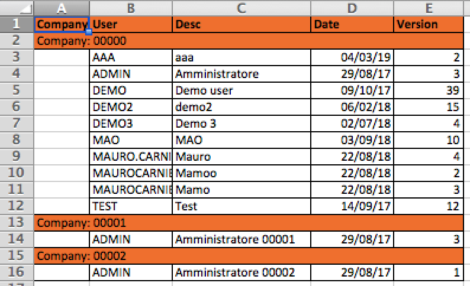

# File

## Execute a series of SQL statements, stored in the specified file.

**Syntax**

```javascript
var rows = utils.executeSqlFile(
sqlFile,
dataSourceId,
separatedTransaction,
interruptExecution,
params
)
```

**Details**

| Argument | Description |
| :--- | :--- |
| rows | int value: number of processed rows |
| sqlFile | absolute path + file name, related to the SQL script to execute |
| dataSourceId | num value; it can be null and used to specify a different db to use with the sql statement |
| separatedTransaction | boolean value; if true, the SQL instruction is executed on a separated transaction which is immediately committed \(as for a REQUIRE\_NEW EJB directive\) |
| interruptExecution | boolean value; if true, an erroneous SQL instruction fires an exception that will interrupt the javascript execution; if false, the js execution will continue |
| params | this is optional: you can omit it at all, or you can specify a series of arguments separated by a comma \(do not use \[\]\); these additional parameters represent values which replace ? symbols in the sql statement. |

An :XXX variable can be replaced by vo or params values

## Send a list of files stored to an FTP server inside the specified remote folder

Files to send must be in the server side file system

**Syntax**

```javascript
var ok = utils.sendFiles(protocol, host, port, useSSL, username, password, toDir, filePaths);
```

**Details**

| Argument | Description |
| :--- | :--- |
| protocol | FTP, FTPS, SFTP |
| host | FTP server host |
| port | FTP server port |

```text
 useSSL - boolean flag, used to specify if FTPS must be used
```

| Argument | Description |
| :--- | :--- |
| username | username to use to authenticate to the FTP server |
| password | password to use to authenticate to the FTP server |
| toDir | remote folder, within the FTP server, where files must be copied |
| filePaths | list of files stored in the server side file system \(expressed with absolute path\) to copy within the FTP server |

## Send a single file to the FTP server and store it in the specified folder

**Syntax**

```javascript
var ok = utils.sendFile(protocol, host, port, useSSL, username, password, destFile, sourceFile);
```

**Details**

| Argument | Description |
| :--- | :--- |
| protocol | FTP, FTPS, SFTP |
| host | FTP server host |
| port | FTP server port \(e.g. 21\) |

```text
 useSSL - boolean flag, used to specify if FTPS must be used
```

| Argument | Description |
| :--- | :--- |
| username | username to use to authenticate to the FTP server |
| password | password to use to authenticate to the FTP server |
| destFile | folder in the FTP server + destination file name where storing the file |
| sourceFile | sourceFile absolute path in the server file system + file name, related to the file to read |

## Read a remote file from FTP server and copy it

Read a remote file, stored within the FTP server and copy it into the specified absolute file, related to the server.

**Syntax**

```javascript
var ok = getFile(protocol, host, port, useSSL, username, password, ftpDir, ftpFileName, localFile);
```

**Details**

| Argument | Description |
| :--- | :--- |
| protocol | FTP, FTPS, SFTP |
| host | FTP server host |
| port | FTP server port \(e.g. 21\) |

```text
 useSSL - boolean flag, used to specify if FTPS must be used
```

| Argument | Description |
| :--- | :--- |
| username | username to use to authenticate to the FTP server |
| password | password to use to authenticate to the FTP server |
| ftpDir | remote folder, within the FTP server, where the file to retrieve is currently stored |
| ftpFileName | file name to retrieve, stored within the specified remote folder |
| localFile | path+file name, where the remote file must be copied, in the server file system |

## Read a list of remote file names

all files must be stored in the same remote folder within the FTP server; file names are filtered according to the specified filter condition.

**Syntax**

```javascript
var listOfFileNames = getFiles(protocol, host, port, useSSL, username, password, remoteDir, fileFilter);
```

**Details**

| Argument | Description |
| :--- | :--- |
| protocol | FTP, FTPS, SFTP |
| host | FTP server host |
| port | FTP server port \(e.g. 21\) |

```text
 useSSL - boolean flag, used to specify if FTPS must be used
```

| Argument | Description |
| :--- | :--- |
| username | username to use to authenticate to the FTP server |
| password | password to use to authenticate to the FTP server |
| remoteDir | remote folder, within the FTP server, where files are stored |
| fileFilter | \(optional\) parameter to use to filter files to read \(e.g. \*.jpg\) |
| listOfFileNames | list of file names \(String objects\) which satisfy the filter condition |

## Delete a single file to the FTP server

**Syntax**

```javascript
var ok = utils.deleteFTPFile(protocol, host, port, useSSL, username, password, remoteDir, fileName);
```

**Details**

| Argument | Description |
| :--- | :--- |
| protocol | FTP, FTPS, SFTP |
| host | FTP server host |
| port | FTP server port \(e.g. 21\) |
| useSSL | boolean flag, used to specify if FTPS must be used |
| username | username to use to authenticate to the FTP server |
| password | password to use to authenticate to the FTP server |
| remoteDir | folder in the FTP server |
| fileName | file name |

## Rename or move a single file to the FTP server

**Syntax**

```javascript
var ok = utils.renameFTPFile(protocol, host, port, useSSL, username, password, fromFileName, toFileName);
```

**Details**

| Argument | Description |
| :--- | :--- |
| protocol | FTP, FTPS, SFTP |
| host | FTP server host |
| port | FTP server port \(e.g. 21\) |
| useSSL | boolean flag, used to specify if FTPS must be used |
| username | username to use to authenticate to the FTP server |
| password | password to use to authenticate to the FTP server |
| fromFileName | absolute path with file name in the FTP server |
| toFileName | new absolute path with file name in the FTP server |

## Extract a file from Alfresco and save it to the specified local file path.

**Syntax**

```javascript
var success = utils.getAlfrescoDocument(id, fileName, destPath);
```

**Details**

| Argument | Description |
| :--- | :--- |
| id | UUID value which identifies the file to retrieve from Alfresco CMS |
| fileName | file name related to the specified if |
| destPath | absolute path related to the A.S. file system, where the file will be saved, once extracted from Alfresco CMS |

## Read the specified file from the source directory and extract signed data and the embedded document

The source file is identified starting from the source directory id + fileName.

The embedded document is then saved in the destination directory. The embedded file, if recognized with a MIME type, is renamed to a name having the original name + its real extension. Otherwise, it is saved with the original source file name.

**Syntax**

```javascript
var obj = utils.getCertMessage(srcDirectoryId, destDirectoryId, fileName);
```

**Details**

| Argument | Description |
| :--- | :--- |
| srcDirectoryId | id used to identify a source folder in the server file system where the file to read has been stored |
| destDirectoryId | id used to identify a folder in the server file system when the extracted document will be saved |
| fileName | file name inside the specified folder |
| obj | embedded document, expressed as a javascript object |

The returned javascript object contains the following attributes:

* expirationDate
* firstName
* lastName
* personId
* signerCountry
* signerId
* signerOrganization
* personalVatNumber
* corporateVatNumber
* corporateName
* personCountry
* mimeType - MIME type for the embedded file; e.g. application/xml, application/pdf, etc.
* destFilePath - absolute path + file name, related to the embedded file

## Read the specified file and extract signed data and the embedded document

The source file is identified through the "srcFileName", containing both the absolute path and the the file name.

The embedded document is then saved in the destination directory. The embedded file, if recognized with a MIME type, is renamed to a name having the original name + its real extension. Otherwise, it is saved with the original source file name.

**Syntax**

```javascript
var obj = utils.getCertMessage(srcFileName, destFolder);
```

**Details**

| Argument | Description |
| :--- | :--- |
| srcFileName | path + file name to analyze |
| destFolder | destination folder; if not specified, the srcFolder will be used |
| obj | embedded document, expressed as a javascript object |

The returned javascript object contains the following attributes:

* expirationDate
* firstName
* lastName
* personId
* signerCountry
* signerId
* signerOrganization
* personalVatNumber
* corporateVatNumber
* corporateName
* personCountry
* mimeType - MIME type for the embedded file; e.g. application/xml, application/pdf, etc.
* destFilePath - absolute path + file name, related to the embedded file

## Read a signed PDF file and extract data coming from the embedded certificate

The source PDF file is identified starting from the source directory id + fileName.

The specified PDF file is signed file, i.e. it contains a certificate; this certificate is then extracted and saved in the destination directory. The certificate file, if recognized with a MIME type, is renamed to a name having the original name + its real extension. Otherwise, it is saved with the original source file name.

**Syntax**

```javascript
var obj = utils.getCertMessageFromPdf(Long srcDirectoryId,Long destDirectoryId,String fileName);
```

**Details**

| Argument | Description |
| :--- | :--- |
| srcDirectoryId | id used to identify a source folder in the server file system where the PDF signed file to read has been stored |
| destDirectoryId | id used to identify a folder in the server file system when the extracted document \(the certificate\) will be saved |
| fileName | file name inside the specified folder |
| obj | embedded document, expressed as a javascript object |

The returned javascript object contains the following attributes:

* expirationDate
* firstName
* lastName
* personId
* signerCountry
* signerId
* signerOrganization
* personalVatNumber
* corporateVatNumber
* corporateName
* personCountry
* mimeType - MIME type for the embedded file; e.g. application/xml, application/pdf, etc.
* destFilePath - absolute path + file name, related to the embedded file
* signDate - the sign date, expressed as a javascript Date  

## Create a zip file containing the list of passed files <a id="zipfiles"></a>

**Syntax**

```javascript
var ok = utils.zipFiles(baseDir,files,zipFile,deleteFilesAfterZip);
```

**Details**

| Argument | Description |
| :--- | :--- |
| baseDir | base dir used to calculate the entry in the zip \(i.e. "C:/xxx/yyy/"\) |
| files | files to zip \(each including an absolute path, "C:/xxx/yyy/fileName.csv"\) |
| zipFile | zip file to create, including the absolute path \(i.e. "C:/aaa/bbb/zipFileName.zip"\) |
| deleteFilesAfterZip | flag used to decide if input files must be deleted after the zip creation |

## Copy the source file to the destination file <a id="copyfile"></a>

Since "destFile" contains a file name too, the source file can be renamed when copied.

**Syntax**

```javascript
var ok = utils.copyFile(srcFile, destFile, replaceExistingFile, deleteSourceFile);
```

**Details**

| Argument | Description |
| :--- | :--- |
| srcFile | absolute path + file name |
| destFile | absolute path + file name |
| replaceExistingFile | flag used to replace the already existing destination file; if set to false and the destination file already exists, the copy process would be interrupted and the returned value would be false |
| deleteSourceFile | flag used to delete the source file, once the file has been copied to the destination path |

## Export grid content and save data in a CSV file

**Syntax**

```javascript
var ok = utils.saveGridExportInCSV(platformBaseUrl, functionId, panelId, filters, orders, attributes, titles, title, toFile);
```

**Details**

| Argument | Description |
| :--- | :--- |
| platformBaseUrl | base URL of the 4WS.Platform installation; e.g. [http://localhost:8080/platform](http://localhost:8080/platform) |
| functionId | function identifier, e.g. the grid title in lowercase |
| panelId | panel identifier of the grid linked to this export |
| filters | list of elements: \["attribute name","operator","value","case sensitive"\] |
| where |  |

```text
 "operator" can be "=", "&gt;", "like", …
 "case sensitive" can be true|false
```

| Argument | Description |
| :--- | :--- |
| orders | list of elements : \["attribute name","sorting order"\] where "sorting order" can be "ASC" or "DESC" |
| attributes | list of attribute names |
| titles | list of header titles |
| title | title showed in the first row |
| toFile | absolute path, including the file name, where the csv will be saved |

## Register a file so that it can be linked to mobile devices

Register a file \(store it in CON55and if needed in CON54 as well\) so that it can be linked to all the registered devices or only to devices linked to the specified username.

**Syntax**

```javascript
utils.addFileToMobileDevices(String fullPathName,String fileName,String username)
```

**Details**

```text
 fullPathName -absolute path, in the central server, where the file is stored; it must include the file name too
 fileName -file name, without the path
```

| Argument | Description |
| :--- | :--- |
| username -it can be null | if so, the file is linked to all registered devices; if this argument is not empty, then the file is linked to all devices binded to this username |

## Create a text file and fill in with the passed content <a id="createtextfile"></a>

**Syntax**

```javascript
var outcome = utils.createTextFile(String fileName, String fileContent, Boolean overwrite, Long directoryId);
```

**Details**

| Argument | Description |
| :--- | :--- |
|  | fileName -file name; it can includes a subpath to append to the base path specified through directoryId |
| fileContent | text content to save |
| overwrite | true to overwrite the file content if already exists, falseto ignore this operation and returns false as result |
| directoryId | directory identifier, used to define the absolute path, in the central server, where the file will be stored; if null, there must be one only entry for this application |
| outcome | true in case of the operation has beenexecuted successfully, an exception otherwise |

## Writing a very long text file on the server file system <a id="getcsvcontent"></a>

**From 5.3.1 version**

Write a very long text file on the server file system, through a 3 steps approach:

* first, open the output stream, through the "opeTextFile" method
* next, add as many rows as you need, by invoking the "writeTotextFile" method multiple times, for each row to add
* finally, close the output stream, by invoking the "closeTextFile"

Data could be retrieved from a SQL query, through the **executeQueryWithCallback** method, since this will ensure a limited amount of memory consumption.

**Syntax for openTextVFile method**

```javascript
var fileId = utils.openTextFile(fileName, overwrite, directoryId, fileAppend);
```

**Details**

| Argument |
| :--- |


|  | Description |
| :--- | :--- |
| fileName | text file name to create within the specified directory |
| overwrite | flag true\|false used to define whether the file must overwrite a previous one |
| directoryId | directory identifier, used to define the absolute path, in the central server, where the file will be stored; if null, there must be one only entry for this application |
| fileAppend | flag true\|false used to define if rows to add must be appneded at the end of  an already existing file |
| fileId | a text id, representing the output stream, to refer in the next two methods. |

**Syntax for writeToTextFile method**

```javascript
var fileId = utils.writeToTextFile(fileId, row)
```

**Details**

| Argument | Description |
| :--- | :--- |
| fileId | a text id, representing the output stream, needed to work qwith the correct output stream |
| row | a text to write; this text does NOT contain a return carriage, so it is up to the programmer to add it, if needed \(e.g. "\r\n"\) |

**Syntax for closeTextFile method**

| Argument | Description |
| :--- | :--- |
| fileId | a text id, representing the output stream, needed to work qwith the correct output stream |

**Example**

```javascript
// open the text file, in order to write into it
var fileId = utils.openTextFile(
    "abc.txt",true,9, true
);

// declare a callback function, invoked by a SQL query, used to write a single line into the text file
var processRow = function(jsonRow) {
    var row = jsonRow.userCodeId+","+jsonRow.description+"\r\n"; // or any other custom logic to use to produce a text content
    utils.writeToTextFile(fileId,row);
}

// execute the SQL query, whose result set will be read row by row, by invoking each time the specified callback
utils.executeQueryWithCallback(
    "processRow", // callback function, invoked for each record coming from the query, whose argument will receive a JSON object representing the record
    "SELECT U.USER_CODE_ID,U.DESCRIPTION,U.PASSWORD,U.DATE_EXPIRATION_PASSWORD,U.ROW_VERSION FROM PRM01_USERS U",
    null,
    false,
    true,
    []
);

// close the text file, after reading all records from the query
utils.closeTextFile(fileId);
```

## Read a text file located on the server <a id="readtextfile"></a>

```javascript
var textString = utils.readTextFile(filePath);
```

**Important note**: please do not use this method in case of a very long text file \(e.g. &gt; 10MB\), since it can consume an excessive amount of memory on the server and reduce the scalability of your application. In case of very long files, use the method described below.

**Details**

| Argument | Description |
| :--- | :--- |
| filePath | Filepath + Filename of the file to read |
| textString | The content of the read file |

## Read a text file located on the server with a specific charset

A text file can be saved with different charset formats. You have to know in advance which format to use. Examples of formats are: UTF-8 or Windows-1252

```javascript
var textString = utils.readTextFile(filePath, charSet);
```

**Important note**: please do not use this method in case of a very long text file \(e.g. &gt; 10MB\), since it can consume an excessive amount of memory on the server and reduce the scalability of your application. In case of very long files, use the method described below.

**Details**

| Argument | Description |
| :--- | :--- |
| filePath | Filepath + Filename of the file to read |
| charSet | the charset to use when reading the text file |
| textString | The content of the read file |

## Read a very long text file

**From 5.3.1 version**

In case of a very long text file, it would be better to read it row by row, in order to limit the amount of data stored in the server.

The following method requires a callback function, which will be invoked automatically, for each line read from the file. The current line \(string\) will be passed forward to the callback method.

```javascript
utils.readTextFile(String fileName,Long directoryId,String callbackFunName);
```

**Details**

| Argument | Description |
| :--- | :--- |
| fileName | text file name to read |
| directoryId | directory id, identifying where the file is located; can work both with server file system and Google Cloud Storage |
| callbackFunName | callback function name, invoked by this one for each row |

## Read a very long text file with charset

**From 5.3.1 version**

In case of a very long text file, it would be better to read it row by row, in order to limit the amount of data stored in the server.

The following method requires a callback function, which will be invoked automatically, for each line read from the file. The current line \(string\) will be passed forward to the callback method.

```javascript
utils.readTextFile(String fileName,Long directoryId,String callbackFunName,String charset);
```

**Details**

| Argument | Description |
| :--- | :--- |
| filePath | text file name to read |
| directoryId | directory id, identifying where the file is located; can work both with server file system and Google Cloud Storage |
| callbackFunName | callback function name, invoked by this one for each row |
| charset | charset to use when reading file; e.g. UTF-8 |

## Read a very long text file located on the server with charset

**From 5.3.1 version**

In case of a very long text file, it would be better to read it row by row, in order to limit the amount of data stored in the server.

The following method requires a callback function, which will be invoked automatically, for each line read from the file. The current line \(string\) will be passed forward to the callback method.

```javascript
utils.readTextFile(String filePath,String callbackFunName,String charset);
```

**Details**

| Argument | Description |
| :--- | :--- |
| filePath | absolute path on the server file system, including the file name to read |
| callbackFunName | callback function name, invoked by this one for each row |
| charset | charset to use when reading file; e.g. UTF-8 |

## Delete a file previously stored in a specific path <a id="deletefile"></a>

**Syntax**

```javascript
var outcome = utils.deleteFile(String fileName,Long directoryId);
```

**Details**

| Argument | Description |
| :--- | :--- |
| fileName | it can includes a subpath to append to the base path specified through directoryId |
| directoryId | directory identifier, used to define the absolute path, in the central server, where the file will be stored; if null, there must be one only entry for this application |
| outcome | true in case of the operation has beenexecuted successfully, an exception otherwise |

## Read the specified URL and convert the HTML content to an image and save it to the server file system.

**Syntax**

```javascript
utils.convertUrlToImage(String url, String imagePath);
```

**Details**

```text
url: URL to read, related to HTML content 
imagePath: absolute path + image file name where saving the image 
fire an exception in case of errors.
```

## Reading the HTML content and convert it to an image and save the image to the server file system.

**Syntax**

```javascript
utils.convertHtmlToImage(String html, String imagePath);
```

**Details**

```text
html: HTML content to read 
imagePath: absolute path + image file name where saving the image 
fire an exception in case of errors.
```

## Reading an xls file stored in the specified path <a id="getxlscontent"></a>

Read up to 10000 rows x 1000 columns from the xls file stored in the specified path and get back the content of a specific folder

**Syntax**

```javascript
var list = utils.getXlsContent(String dirId,String fileName,int sheetIndex,int fromRow,String... attributeNames);
```

**Details**

```text
 dirId: path identifier
  fileName name of the xls file
 sheetIndex sheet index inside the spreadsheet, starting from 0
 fromRow the content will be read starting from the specified row index (the first row has index 0)
 attributeNames, list of attributes, assigned to each column, starting from leftmost column to the right
 return a list of js objects, where each object is expressed as a set of couples &lt;attributename, related value&gt;
```

Values stored in each js object can be accessed as: object.get\("attributeName"\)

## Reading a csv file stored in the specified path <a id="getcsvcontent"></a>

Read up to the specified number of rows, starting from the specified index \(0..x\) from the csv file stored in the specified path and get back the content of a specific folder

dirId path identifier  
fileName name of the csv file  
attributeNames, list of attributes, assigned to each column, starting from leftmost column to the right

**Syntax**

```javascript
var list = utils.getCsvContent(String sep,String dirId,String fileName,Integer startRow,Integer blockSize,Boolean removeEmptyValues,String... attributeNames);
```

**Important note**: this method should NOT be used in case of very long CSV files, since it can consume a large amount of memory on the server. In case of a very long CSV file, please refer the next method.

**Details**

```text
 sep tokens separator: ; or ,
 dirId: path identifier; optional and helpful for files stored in the cloud; you can set it to null, to save temporarelly the uploaded file in the tmp dir of the application server
 fileName: name of the csvfile
```

startRow row index; if null it is the first row, i.e. 0

blockSize max number of rows to read, if available; if null it is set to 10000

attributeNames, list of attributes, assigned to each column, starting from leftmost column to the right

```text
 return a list of js objects, where each object is expressed as a set of couples <attributename, related value>
```

A list of js objects, where each object is expressed as a set of couples &lt;attributename, related value&gt;; a 0 length list in case of no more rows available.  
It supports also nested objects and list of objects: it depends on the definition of the attribute lists.  
A few examples of attributes:  
\[ "attr1", "subobject.attrsub1", "subobject.attrsub2", "sublist\[0\].subattr3","sublist\[0\].subattr4","sublist\[1\].subattr5" \]

## Reading a very long csv file stored in the specified path <a id="getcsvcontent"></a>

**From 5.3.2 version**

In case of very long CSV files to read \(e.g. &gt; 1MB\), it would be better to avoid reading the whole content and maintain it in the server memory, until the end of its processing: this could lead to an excessive amount of memory consumption.

The best approach consists of reading that file row by row and maintain in memory only one row per time. The following method allows to do it: a callback function is used to process a single row and it is invoked automatically when reading the CSV file.

**Syntax**

```javascript
utils.readCSVFile(
  fileName,
  directoryId,
  sep,
  skipFirstRow,
  callbackFunName,
  attributeNames
);
```

**Details**

| Argument | Description |
| :--- | :--- |
| filenName | CSV file name to read from the specified directory |
| directoryId | directory identifier, used to define the absolute path, in the central server, where the file is already located |
| sep | field separator; allowed values: , or ; |
| skipFirstRowflag | true\|false, indicating whether the first row in the file should me skipped, for instance because it contains the column header names. |
| callbackFunName | callback function name which will be invoked for each row read from the CSV file. Such a function must be declared before the invocation of this one, and must include and argument used to pass forward the js object representing data read for theCS |
| attributeNames | will be created and filled with the values coming from the fields, each with the specified attribute name |

**Example**

```javascript
var processRow = function(row) {
    utils.log(
        row.userCodeId+"-"+row.password+"-"+row.rowVersion+"-"+row.dateExpirationPassword,
        "INFO"
    );
}

utils.readCSVFile(
    "myfile.csv", // file name
    9, // data source id
    ",", // separator
    false, 
    "processRow", // callback function name
    ["userCodeId","password","rowVersion","dateExpirationPassword"]
);
```

## Reading a very long csv file stored in the specified path and write it directly to a database table <a id="getcsvcontent"></a>

**From 5.3.2 version**

In case of very long CSV files to read \(e.g. &gt; 1MB\), it would be better to avoid reading the whole content and maintain it in the server memory, until the end of its processing: this could lead to an excessive amount of memory consumption.

The best approach consists of reading that file row by row and maintain in memory only one row per time. The following method allows to do it; moreover, this method is optimized in case you need to load data into a database table.

This methods allows to read part of data from the CSV file and part from default values. You can also read only a part of the columns provided in the CSV file.

**Syntax**

```javascript
var processedRows = utils.readCSVFileAndWriteToTable( 
  fileName,
  directoryId,
  sep,
  skipFirstRow,
  datastoreId,
  tableName,
  defaultFieldNames,
  csvFields
);
```

**Details**

| Argument | Description |
| :--- | :--- |
| filenName | CSV file name to read from the specified directory |
| directoryId | directory identifier, used to define the absolute path, in the central server, where the file is already located; can be null |
| sep | field separator; allowed values: , or ; |
| skipFirstRowflag | true or false, indicating whether the first row in the file should me skipped, for instance because it contains the column header names. |
| datastoreId | data source id which identifies where the table to load is located |
| tableName | name of the table where data will be loaded |
| defaultFieldNames | javascript object containing the list of additional table fields to fill in, expressed as field name + value; example: { STATUS: "E", CREATE\_DATE: new java.sql.Date\(\) } |
| csvFields | list of javascript objects, one for each CSV column; the object structure can contains optionally these attributes: { fieldName: "....", convertToSqlDate: "yyyy-MM-dd", convertToSqlTimestamp: "yyyy-MM-dd HH:mm:ss" }. This object allows to define whether the CSV column must be used to fill in the corresponding table field specified through "fieldName" attribute; if this attribute is omitted, the CSV column is ignored when importing the row; the other two attributes \(convertXXXX\) are optional and must be used in case a CSV column must be mapped to a DATE or DATETIME table field. Another property is trim: true\|false, used to remove spaces from text type fields. |

**Example**

```javascript
var processedRows = utils.readCSVFileAndWriteToTable(
    "myproducts.csv", // file name
    9, // data source id
    ",", // separator
    false, 
    null, // data source id: default database schema
    "MY_TABLE", // table name where inserting data
    { // these are the default values to include in every INSERT
       STATUS: "E", 
       CREATE_DATE: new java.sql.Timestamp(),
       USER_ID_CREATE: userInfo.username,
       ROW_VERSION: 1
    },
    [ // this is the list of CSV columns
    { fieldName: "PRODUCT_CODE" },
    {}, // second CSV column ignored, since it does not contain the "fieldName" attribute
    { fieldName: "DESCRIPTION" },
    { fieldName: "START_DATE", convertToSqlDate: "yyyy-MM-dd" } // we suppose that this column contains a date expressed in such format
    ]
);
```

## Writing a csv file on the server file system <a id="getcsvcontent"></a>

Write a CSV file on the server file system, starting from a list of data provided in input.

Data could be retrieved from a SQL query, through the executeQuery method.

**Syntax**

```javascript
var outcome = utils.createCSVFile(
  fileName,
  overwrite,
  directoryId, 
  data, 
  sep,
  languageId,
  exportAttributes,
  exportColumns,
  formatColumns,
  printTitles,
  fileAppend
);
```

**Important note**: this method should NOT be used in case of very long CSV files, since it can consume a large amount of memory on the server. In case of a very long CSV file, please refer the next method.

**Details**

| Argument | Description |
| :--- | :--- |
| filenName | CSV file name to create within the specified directory |
| directoryId | directory identifier, used to define the absolute path, in the central server, where the file will be stored; if null, there must be one only entry for this application |
| data | list of js objects, one for each row to save into the CSV file |
| sep | field separator; allowed values: , or ; |
| languageId | IT, EN, ... |
| exportAttributes | list of attribute names to export into the CSV file |
| exportColums | list of column headers to include as the first row in the CSV file |
| formatColumns | optional list of formatters to apply to the data defined in each js object, in order to convert data to text \(e.g. "0.00" to covnert a number to string\) |
| printTitles | flag true\|false, indicating whether the column headers must be included as the first row in the CSV file |
| outcome | "" in case of the operation has been executed successfully, the error message otherwise |

## Writing a very long csv file on the server file system <a id="getcsvcontent"></a>

**From 5.3.2 version**

Write a very long CSV file on the server file system, through a 3 steps approach:

* first, open the output stream, through the "openCSVFile" method
* next, add as many rows as you need, by invoking the "writeToCSVFile" method multiple times, for each row to add
* finally, close the output stream, by invoking the "closeCSVFile"

Data could be retrieved from a SQL query, through the **executeQueryWithCallback** method, since this will ensure a limited amount of memory consumption.

**Syntax for openCSVFile method**

```javascript
var fileId = utils.openCSVFile(fileName, overwrite, directoryId, sep, fileAppend, attributesToWrite, formatters)
```

**Details**

| Argument | Description |
| :--- | :--- |
| fileName | CSV file name to create within the specified directory |
| overwrite | flag true\|false used to define whether the file must overwrite a previous one |
| directoryId | directory identifier, used to define the absolute path, in the central server, where the file will be stored; if null, there must be one only entry for this application |
| sep | field separator; allowed values: , or ; |
| fileAppend | flag true\|false used to define if rows to add must be appneded at the end of  an already existing file |
| attributesToWrite | list of attribute names to export into the CSV file |
| formatters | optional list of formatters to apply to the data defined in each js object, in order to convert data to text \(e.g. "0.00" to covnert a number to string\) |
| fileId | a text id, representing the output stream, to refer in the next two methods. |

**Syntax for writeToCSVFile method**

```javascript
var fileId = utils.writeToCSVFile(fileId, obj)
```

**Details**

| Argument | Description |
| :--- | :--- |
| fileId | a text id, representing the output stream, needed to work qwith the correct output stream |
| obj | javascript object, containing data to write as a row in the CSV file; data contains attributes referred in the previous method through "attributrstoWrite" argument |

**Syntax for closeCSVFile method**

```javascript
var fileId = utils.closeCSVFile(fileId)
```

**Details**

| Argument | Description |
| :--- | :--- |
| fileId | a text id, representing the output stream, needed to work qwith the correct output stream |

**Example**

```javascript
// open the CSV file, in order to write into it
var fileId = utils.openCSVFile(
    "ab.csv",true,9, ",",true,
    ["userCodeId","password","rowVersion","dateExpirationPassword"],
    [null,null,null,null]
);

// declare a callback function, invoked by a SQL query, used to write a single line into the CSV file
var processRow = function(jsonRow) {
    utils.writeToCSVFile(fileId,jsonRow);
}

// execute the SQL query, whose result set will be read row by row, by invoking each time the specified callback
utils.executeQueryWithCallback(
    "processRow", // callback function, invoked for each record coming from the query, whose argument will receive a JSON object representing the record
    "SELECT U.USER_CODE_ID,U.DESCRIPTION,U.PASSWORD,U.DATE_EXPIRATION_PASSWORD,U.ROW_VERSION FROM PRM01_USERS U",
    null,
    false,
    true,
    []
);

// close the CSV file, after reading all records from the query
utils.closeCSVFile(fileId);
```

## Writing a very long csv file on the server file system from a SQL query <a id="getcsvcontent"></a>

**From 5.3.2 version**

Write a very long CSV file on the server file system, starting from a SQL query.

```javascript
var errorMsg = utils.createCSVFileFromSQLQuery(
   fileName, overwrite, directoryId, sep, languageId, printTitles, fileAppend, formatColumns,
   datasourceId,
   sqlQuery,
   pars
);
```

**Details**

| Argument | Description |
| :--- | :--- |
| fileName | CSV file name to create within the specified directory |
| overwrite | flag true/false used to define whether the file must overwrite a previous one |
| directoryId | directory identifier, used to define the absolute path, in the central server, where the file will be stored; if null, there must be one only entry for this application |
| sep | field separator; allowed values: , or ; |
| languageId | language to use when formatting date values |
| printTitles | flag true/false used to incude a first row within the CSV file related to the SELECT field names |
| fileAppend | flag true/false used to define if rows to add must be appneded at the end of  an already existing file |
| formatColumns | optional list of formatters to apply to the data defined in each js object, in order to convert data to text \(e.g. "0.00" to covnert a number to string\) |
| datasourceId | datasource id which identifies the database schema where reading data |
| sqlQuery | SQL query to execute, in order to fill in the CSV file |
| pars | list of javascript values, related to binding variables expressed as ? |

**Example**

```javascript
var errors = utils.createCSVFileFromSQLQuery(
   "mycsffile.csv", 
   false, // overwrite, 
   xyz, // directoryId where the file csv will be created
   ";", // separator to use among the CSV fields
   "IT", // languageId
   true, // printTitles
   false, //  fileAppend
   null, // formatColumns
   datasourceId,
   "SELECT FIELD1,FIELD2,FIELD3 FROM MYTABLE WHERE FIELDX=?",
   ["VALUEFORFIELDX"]
);
```

## Writing data to CloudSQL from a CSV file stored in Google Cloud Storage <a id="getcsvcontent"></a>

**From 5.3.2 version**

Starting from a CSV file stored in Google Cloud Storage, this method allows to load the whole content to a CloudSQL instance, in the specified table/schema, always in append mode.

In order to use this function, a Google cloud administrator must set the correct grants to the GCS and CloudSQL services.

```javascript
utils.importDataInCloudSQL(instance, bucketPath, dbSchema, dataSourceId, tableName, where, timeout, columns);
```

**Details**

| Argument | Description |
| :--- | :--- |
| instance | CloudSQL instance name; this value is reported within the Google Cloud Console |
| bucketPath | GCS bucket name + subpath + file name for the CSV, expressed as gs://bucketname/filename.csv |
| dbSchema | database schema where the table to load is located |
| dataSourceId | datasource id related to the schema specified with the previous argument |
| tableName | table where saving data coming from the CSV file |
| where | can be null; optional WHERE condition to include in the SQL query automatically executed \(every 2 seconds\) in order to check out if the data to import has been loaded. In null, it is assumed that the table is empty and the executed query would be "SELECT COUNT\(\*\) FROM tablename". This method terminates when the returned value is &gt; 0. If this argument is filled in, the query would be "SELECT COUNT\(\*\) from tablename WHERE yourwhere". Again, the method terminates when there is at least one record |
| timeout | max number of seconds to wait before a timeout is fired, waiting from the completition of data loading on the table |
| columns | list of table fields where the CSV data will be saved: these fields must be as many as the number of columns in the CSV file |

**Example**

```javascript
utils.importDataInCloudSQL(
    "cloudsqlinstancename",
    "gs://mybucket/myfile.csv",
    "mydatabaseschema",
    mydatasourceid,
    "mytable",
    "MYFIELD = 'XYZ' ",
    50,// max number of seconds to wait
    ["STATISTICS","VALUE","POSITION","DDS","TOTALE","PERCENTUALE"] // table field names/CSV columns
);
```

## Convert a TIFF image to a JPEG image

**Syntax**

```javascript
utils.convertTifToJpg(Long tifDirId,String tifFileName,Long jpgDirId,String jpgFileName,Float compressionFactor);
```

**Details**

```text
tifDirId - folder identifier, where the input TIFF imagefile is already stored 
tifFileName -TIFF image file name, stored in the folder identified by tifDirId 
jpgDirId- folder identifier, where the JPEG image will be saved 
jpgFileName- file name for the JPEG image to create 
compressionFactor- positive number <= 1.0, used to define the compression factor the JPEG image
```

## Renaming a file on the file system

Starting from a directory definition, related to the server file system, rename an already existing file to a new name, in the same directory.

**Syntax**

```javascript
var ok = utils.renameFile(dirId, oldFileNane, newFileName);
```

This method can fire an exception either in case the specified "oldFileName" does not exist within the specified directory or when the newFileName already exists.

In case of successful renaming, the method returns a true value.

## Export data from database in xlsx format

Starting from a SQL query and bind variables, generate an xlsx file.

It is possible to customize this file in a variety of different ways:

* defining the sheet name
* adding new sheets to an already existing xlsx \(used as template\)
* adding a row at the beginning, reporting the column headers
* customizing horizontal alignment, column width, background/foreground color for each cell \(both for header and data rows\), font \(name, size, bold/italic/underline\), data format \(for dates and numbers\)
* breaking up rows in sections, according to the value of one column \(grouping data\) and adding an header row at the beginning of each section; optionally, a footer row can be included as well, where specifying Excel functions \(es. SUM, COUNT, etc.\)

**Syntax**

```javascript
var exportedRows = utils.createXLSXFileFromSQLQuery(
        Long templateDirectoryId,
        String templateFileName,
        String sheetName,
        Long outDirectoryId,
        String outFileName,
        Map[] formatHeaderColumns,
        Map[] formatColumns, 
        Map grouping,
        Map additionalSettings,
        Long datastoreId,
        String sqlQuery,
        Object[] pars
);
```

**Details**

| Argument | Description |
| :--- | :--- |
| templateDirectoryId | can be null; if specified, the xlsx file to create will be generated starting from a copy of an already existing xlsx file to use as a template; such a template file is located in this directory; if not specified, the xlsx file to create will be generated form scratch |
| templateFileName | can be null; this argument must be specified together with "templateDirectoryId: it represents the xlsx file name of the template file to use when creating the new xlsx file |
| sheetName | name for the sheet to create within the xlsx file |
| outDirectoryId | path where storing the xlsx file |
| outFileName | xlsx file to create, within the path specified through "outDirectoryId" |
| formatHeaderColumns | can be null: in such a case, there will not be a first header row. If specified, it must be list of javascript objects, where each object is related to the settings of a column header, so it can be used to specify the column header properties, like title, foreground/background color, font \(name, size, style\), alignment. See below for the allowed values for each property |
| formatColumns | can be null: in such a case, each numeric/date column will be formatted automatically; the column width will be automatically defined, starting from the column header name. If specified, it must be list of javascript objects, where each object is related to the settings of a \(data\) column, so it can be used to specify the \(data\) column properties, like width, foreground/background color, font \(name, size, style\), alignment. See below for the allowed values for each property |
| grouping | can be null; if specified, it allows to break up a rows according to the value of a specific column, used to group rows. Each time a different value for that column is found, an additional row is added to the spreadsheet. Optionally, a footer row can be included as well, helpful to execute Excel formulas, like SUM or COUNT, for example. The "grouping" attribute must be a javascript object containing at least the attribute "fieldName". See below for the whole object content. |
| additionalSettings | set it to null, since at the moment is not managed |
| datastoreId | related to the database scheme where executing the SQL query to use to fill in the xlsx file. |
| sqlQuery | SQL query to execute |
| params | list of javascript objects representing the values for the bind variables expressed in the "sqlQuery" through ? symbols. |

Structure of a javascript object contained in the list of objects composing the "formatHeaderColumns":

| Attribute name | Description |
| :--- | :--- |
| title | header name; it is mandatory |
| backColor | can be null; background color. It must be expressed as a string, among the ones recognized by Excel and reported below in "Supported colors" |
| foreColor | can be null; foreground color. It must be expressed as a string, among the ones recognized by Excel and reported below in "Supported colors" |
| fontName | can be null; font name, recognized by Excel, like "Arial", "Courier", ... |
| fontSize | can be null; Font dimension, expressed in points, like 100, 200, etc. |
| bold | can be null; boolean value: if set to true, the title will be set in bold |
| italic | can be null; boolean value: if set to true, the title will be set in italic \(corsive\) |
| underline | can be null; boolean value: if set to true, the title will be underlined |
| align | horizontal alignment; supported values are: "LEFT", "CENTER", "RIGHT", "JUSTIFY" |

Structure of a javascript object contained in the list of objects composing the "formatColumns":

| Attribute name | Description |
| :--- | :--- |
| width | can be null; column width, expressed in points |
| backColor | can be null; background color. It must be expressed as a string, among the ones recognized by Excel and reported below in "Supported colors" |
| foreColor | can be null; foreground color. It must be expressed as a string, among the ones recognized by Excel and reported below in "Supported colors" |
| fontName | can be null; font name, recognized by Excel, like "Arial", "Courier", ... |
| fontSize | can be null; Font dimension, expressed in points, like 100, 200, etc. |
| bold | can be null; boolean value: if set to true, the title will be set in bold |
| italic | can be null; boolean value: if set to true, the title will be set in italic \(corsive\) |
| underline | can be null; boolean value: if set to true, the title will be underlined |
| align | horizontal alignment; supported values are: "LEFT", "CENTER", "RIGHT", "JUSTIFY" |
| format | can be null; in case of a column having date type, the format should be "m/d/yy", in case of a numeric column it can be "\#,\#\#0.00". See the following link for all supported values: [https://poi.apache.org/apidocs/dev/org/apache/poi/ss/usermodel/BuiltinFormats.html](https://poi.apache.org/apidocs/dev/org/apache/poi/ss/usermodel/BuiltinFormats.html) |

Structure of the javascript object for "grouping":

| Attribute name | Description |
| :--- | :--- |
| fieldName | field name: mandatory field; it must be one of the fields reported in the SELECT clause |
| showColumn | can be null; boolean value; if set to false, the column related to "fieldName" will be hidden, since it contains always the same value for all rows in the same section |
| showValue | can be null; boolean value; if set to false, the column related to "fieldName" is shown but the value is not reported \(empty cell\), since it contains always the same value for all rows in the same section |
| headerRow | optional attribute: it is a list of javascript objects, where each object defines a cell to include in the header row added before each section. This object must contains a "title" attribute; optionally it can include all other attributes reported for "formatHeaderColumns"; moreover, it is possible to specify "colSpan" attribute, indicating the number of cells occupied by the current cell. The "title" attribute can contain fixed text and/or values coming from the current record, expressed as &lt;FIELDNAME&gt; |
| footerRow | Same as for "headerRow," but used to define the optional footer section. Unlike the "headerRow", the "title" attribute can also contain a formula, always applied to the current section. A formula is expressed as "=FORMULA" or "=FORMULA,COLUMNNAME". For example, if you want to apply a SUM to all cells in the column B, limited to the current section, you can define "=SUM,B" |

List of supported colors, in background/foreground colors:

AQUA , AUTOMATIC , BLACK , BLACK1 , BLUE , BLUE\_GREY , BLUE1 , BRIGHT\_GREEN , BRIGHT\_GREEN1 , BROWN , CORAL , CORNFLOWER\_BLUE , DARK\_BLUE , DARK\_GREEN , DARK\_RED , DARK\_TEAL , DARK\_YELLOW , GOLD , GREEN , GREY\_25\_PERCENT , GREY\_40\_PERCENT , GREY\_50\_PERCENT , GREY\_80\_PERCENT , INDIGO , LAVENDER , LEMON\_CHIFFON , LIGHT\_BLUE , LIGHT\_CORNFLOWER\_BLUE , LIGHT\_GREEN , LIGHT\_ORANGE , LIGHT\_TURQUOISE , LIGHT\_TURQUOISE1 , LIGHT\_YELLOW , LIME , MAROON , OLIVE\_GREEN , ORANGE , ORCHID , PALE\_BLUE , PINK , PINK1 , PLUM , RED , RED1 , ROSE , ROYAL\_BLUE , SEA\_GREEN , SKY\_BLUE , TAN , TEAL , TURQUOISE , TURQUOISE1 , VIOLET , WHITE , WHITE1 , YELLOW , YELLOW1

For a preview of these colors, see the following link:

[https://github.com/ClosedXML/ClosedXML/wiki/Excel-Indexed-Colors](https://github.com/ClosedXML/ClosedXML/wiki/Excel-Indexed-Colors)

**Example**

Grouping data with an header row for each section, containing a description spreading the whole row

```javascript
var exportedRowsNumber = utils.createXLSXFileFromSQLQuery(
        null,null, // templateDirectoryId + templateFileName
        "My Sheet", // sheetName,
        9, // directory id for the destination xlsx file
        "myfile.xlsx", // outDirectoryId
        formatHeaderColumns: [
              { title: "Company", bold: true, backColor: "ORANGE" },
              { title: "User", bold: true, backColor: "ORANGE" },
              { title: "Desc", bold: true, backColor: "ORANGE" },
              { title: "Date", bold: true, backColor: "ORANGE" },
              { title: "Version", bold: true, backColor: "ORANGE" }
        ],
        formatColumns: [
              { width: 200 },
              { width: 300 },
              { width: 500 },
              { width: 300,format: "m/d/yy" },
              { width: 250 }
        ],
        grouping: {
              fieldName: "COMPANY_ID",
              showValue: false,
              headerRow: [
                    { title: "Company: <COMPANY_ID>", backColor: "ORANGE",colSpan: 5 },
                    { title: "", backColor: "ORANGE" },
                    { title: "", backColor: "ORANGE" },
                    { title: "", backColor: "ORANGE" },
                    { title: "", backColor: "ORANGE" }
              ]
        }, // grouping
        null, // additionalSettings
        null, // datastoreId
        "SELECT COMPANY_ID,USER_CODE_ID,DESCRIPTION,CREATE_DATE,ROW_VERSION FROM PRM01_USERS",
        [] // pars
);
```



**Example**

Grouping data with an header row for each section, containing a description spreading the whole row; at the end of each section there is also a footer row with the last cell containing the SUM of values for column "E"

```javascript
var exportedRowsNumber = utils.createXLSXFileFromSQLQuery(
        null,null, // templateDirectoryId + templateFileName
        "My Sheet", // sheetName,
        9, // directory id for the destination xlsx file
        "myfile.xlsx", // outDirectoryId
        formatHeaderColumns: [
              { title: "Company", bold: true, backColor: "ORANGE" },
              { title: "User", bold: true, backColor: "ORANGE" },
              { title: "Desc", bold: true, backColor: "ORANGE" },
              { title: "Date", bold: true, backColor: "ORANGE" },
              { title: "Version", bold: true, backColor: "ORANGE" }
        ],
        formatColumns: [
              { width: 200 },
              { width: 300 },
              { width: 500 },
              { width: 300,format: "m/d/yy" },
              { width: 250 }
        ],
        grouping: {
              fieldName: "COMPANY_ID",
              showValue: false,
              headerRow: [
                    { title: "Company: <COMPANY_ID>", backColor: "ORANGE",colSpan: 5 },
                    { title: "", backColor: "ORANGE" },
                    { title: "", backColor: "ORANGE" },
                    { title: "", backColor: "ORANGE" },
                    { title: "", backColor: "ORANGE" }
              ],
              footerRow: [
                    { title: "", backColor: "ORANGE" },
                    { title: "", backColor: "ORANGE" },
                    { title: "", backColor: "ORANGE" },
                    { title: "Nr. of users", backColor: "ORANGE" },
                    { title: "=COUNT", backColor: "ORANGE" }
              ]
        }, // grouping
        null, // additionalSettings
        null, // datastoreId
        "SELECT COMPANY_ID,USER_CODE_ID,DESCRIPTION,CREATE_DATE,ROW_VERSION FROM PRM01_USERS",
        [] // pars
);
```


