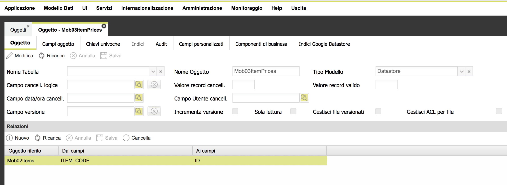
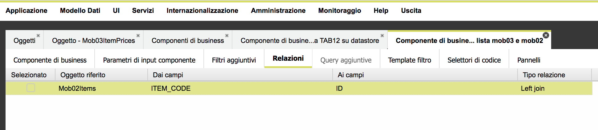

# Google Datastore

## Execute a GQL query on Google Datastore

The datastore must be already configured as a global parameter. Once done that, it is possible to execute a query statement, in order to fetch a list of entities.\
The query language is GQL: filtering and sorting conditions are strictly ruled by the Google datastore. That means that additional indexes could be defined before executing the query. For instance, = operators can be used without additional indexes, but it is not so for sorting conditions or filtering conditions having not equal operators (e.g. <, <=, etc.).\
See Datastore syntax to get detail information about the syntax to use when filtering entities.

**Syntax**

```javascript
var json = utils.executeQueryOnGoogleDatastore(gql,dataModelId,interruptExecution, params);
```

**Details**

| Argument           | Description                                                                                                                                                                                                          |
| ------------------ | -------------------------------------------------------------------------------------------------------------------------------------------------------------------------------------------------------------------- |
| gql                | string value: GQL query to execute; it can contain ? or :XXX                                                                                                                                                         |
| dataModelId        | it identifies the data model having "datastore" type, related to the entity to enquiry, so the GQL query must refer the same entity name related to the specified data model                                         |
| interruptExecution | boolean value; if true, an erroneous GQL instruction fires an exception that will interrupt the javascript execution; if false, the js execution will continue                                                       |
| params             | this is optional: you can omit it at all, or you can specify a series of arguments separated by a comma (do not use \[]); these additional parameters represent values which replace ? symbols in the sql statement. |
|                    | XXX variable can be replaced by vo or params values                                                                                                                                                                  |

Example

```javascript
var json = utils.executeQueryOnGoogleDatastore(
"SELECT * FROM Products WHERE companyId=:COMPANY_ID AND enabled='Y' ",
XXX, // XXX must be the data model id
true, // fire an Execution in case of error
[]
);
```

Note: every GQL instruction will be logged.

Note: in case of a data model where there are attributes having type **Array**, this method will get back also the array value, expressed as a String whose values are separated by a comma.

**Important note:** please use the cached version of this method as often as possible:

```javascript
var json = utils.executeCachedQueryOnGoogleDatastore(maxCachedEntities, gql,dataModelId,interruptExecution, params);
```

where **maxCachedEntities** is the max number of cached entities having the same entity name specified in the GQL query.

## Speeding up GQL queries

The previous method **executeQueryOnGoogleDatastore** can sometimes return the result after a while.&#x20;

A GQL query can be particularly slow when:

* there are **many filter conditions in the WHERE clause**: even when the WHERE clause of a query includes only single property indexes, the query can be very slow; this is due to the internal mechanism used by Datastore, where the use of equality filters on one or more properties, leads to a "merged join", so something like first name = Bob and last name = James, leads to merging the results of the two conditions; consequently, the more indexes are used, the slower the query becomes.
* the entity contains many properties: the more properties an entity contains, the more workload is spent to get all of them
* the entity has **too** **many indexed properties**; Google states that: "_If a property will never be needed for a query,_ [_exclude the property from indexes_](https://cloud.google.com/datastore/docs/concepts/indexes#unindexed\_properties)_. Unnecessarily indexing a property could result in **increased latency** and increased_ [_storage costs of index entries_](https://cloud.google.com/datastore/docs/concepts/storage-size#index\_entry\_size)_._"
* there is not a composite index defined for the query: a composite index, even when you are not using "not equal" filters, can speed up the query execution&#x20;
* there are many writing operations in progress

Consequently, good practices to speed up queries are:

1. do not create queries having many filtering conditions; if you notice a poor performance, try to reduce the conditions or take into account the chance to define a composite index for such a query.
2. if your entity contains a lot of properties and you do not need all of them (i.e. you are not use retrieved data to update it later), the query is a good candidate for a "projection query" (see below)
3. remove all unnecessary indexes for properties
4. do not overdo with the creation of composite indexes: you cannot create more than 200 composite indexes in a GCP project!

For additional details,  read the following documents:






**Projection queries**

A projection query allows to specify only a part of all entity properties. Consequently, the query executing is faster, but you cannot use retrieved data to update the entity later, since you do not have  the whole entity content.

There are several requirements and limitations for a projection query:

* you must define a composite index for it
* properties specified in the SELECT clause&#x20;
  * must be indexed properties
  * cannot be included in the WHERE clause as equality filter
* a timestamp property in the SELECT clause is returned as an integer

For additional details,  read the following documents:




## Execute and cache a complex join-based GQL query on Google Datastore&#x20;

The datastore must be already configured as a global parameter. Once done that, it is possible to execute a query statement, in order to fetch a list of entities.\
The query language is GQL: filtering and sorting conditions are strictly ruled by the Google datastore. That means that additional indexes could be defined before executing the query. For instance, = operators can be used without additional indexes, but it is not so for sorting conditions or filtering conditions having not equal operators (e.g. <, <=, etc.).\
See Datastore syntax to get detail information about the syntax to use when filtering entities.

This method is an extension of the previous one and not only executes the main GQL query but also **executes a secondary query** (**or more than one**) to fetch additional data coming from other entities; after doing it, combine the secondary results with the ones retrieved by the main query, in a similar way to the JOIN condition with SQL query: you have to specify the matching condition, i.e. which attribute in the main entity contains a value which is a primary key on the secondary entity and use it to combine results (we can call such attribute in the main entity a sort of "**foreign key**"). A more complex scenario is when the "foreign key" is no exactly the primary key on a secondary entity but only a part of it.

For example, you can have a "Pricelist" entity having attributes like "companyId" = "00000", siteId = "500" and a "foreign key" attribute named "itemCode" containing something like "PROD1", "PROD2", etc. whereas a secondary entity "Items" can have a primary key attribute defined as a concatenation of values stored in other attributes, like companyId, siteId, itemCode, i.e. "00000\_500\_PROD1" or "00000\_500\_PROD2, etc.". In this example, the matching condition is NOT "itemCode" in "Pricelist" equals to the primary key in "Items", but a more complex one, like the concatenation companyId+"\_"+siteId+"\_"+itemCode.

Platform supports all scenarios reported above:&#x20;

* a single attribute in main entity matching the primary key in the secondary entity
* a concatenation of multiple attributes/constant values in main entity matching the primary key in the secondary entity

Before seeing how to do it, it is important to define **relationships** at object level.

In the data model definition, it is possible to define a number of relationships starting from the current data model (a Datastore entity) to any other, where each relation is identified by a "foreign key" attribute belonging to the main entity. This "foreign key" is not actually  used to create the matching condition but only to identify and distinguish different relationships.



Once done that, it is possible to use there relationships in a javascript business component: when creating a javascript business component, **choose the main entity and select the relationships to activate** for the current business component. Only after that, save the business component. These relationships cannot be changed in edit, once configured at insert time, so be careful!



At this point, any panel (a grid, a form panel, etc.) created starting from this business component will inherit not only the attributes for the main entity but also the ones for any secondary entity activated through the corresponding relationship.

The javascript function to use in the business component in order to get a paginated list of results where additional queries are executed to match data of the main entity and secondary ones is described below.

**Syntax**

```javascript
var json = utils.executeQueryOnGoogleDatastoreWithSettings(
  gql,
  dataModelId,
  interruptExecution, 
  settings,
  params
);
```

**Details**

| Argument           | Description                                                                                                                                                                                                          |
| ------------------ | -------------------------------------------------------------------------------------------------------------------------------------------------------------------------------------------------------------------- |
| gql                | string value: GQL query to execute; it can contain ? or :XXX                                                                                                                                                         |
| dataModelId        | it identifies the data model having "datastore" type, related to the entity to enquiry, so the GQL query must refer the same entity name related to the specified data model                                         |
| interruptExecution | boolean value; if true, an erroneous GQL instruction fires an exception that will interrupt the javascript execution; if false, the js execution will continue                                                       |
| settings           | optional javascript object (can be null); if set, it allows to define one of more "virtual joins" to secondary objects                                                                                               |
| params             | this is optional: you can omit it at all, or you can specify a series of arguments separated by a comma (do not use \[]); these additional parameters represent values which replace ? symbols in the sql statement. |

The "**settings**" javascript object can contain a series of attributes, all optionals, to use according to the need:

* **secondaryObjects** attribute: it contains a list of descriptors, one for each secondary entity to match; each descriptor defines the secondary object to match and the attribute name in the main entity which would contain **the whole secondary object.** For example, if the main entity "Mob03ItemPrices" has a relationship with "Mob02Items", the resulting JSON produced by the b.c. would be: &#x20;

{ valueObjectList: \[{ attributes for Mob03ItemPrices...., mob02Items: { attributes for Mob02Items... } }..

* **secondaryAttributes**: attribute: it contains a list of descriptors, one for each secondary entity to match; each descriptor defines the secondary object to match and a series of attribute names in the main entity which would contain the corresponding attributes found in the secondary object. This variant is finer than the first one, which works on the whole secondary object. This second version is helpful **to map secondary values to virtual attributes in the main entity**. For example, if the main entity "Mob03ItemPrices" does not have a relationship with "Mob02Items" but only a virtual attribute to map, the resulting JSON produced by the b.c. would be:&#x20;

{ valueObjectList: \[{ attributes for Mob03ItemPrices....,  virtualAttributeOfMob02Items: "...."  }..

```javascript
var settings = {

      // 1) inject a cached secondary object in to the specified attribute; required settings: 
      secondaryObjects: [
        {
           name: "...", // attribute name in the main object, where jnjecting the retrieved secondary object
           objectName: "...", // secondary object; you can use dataModelId instead
           dataModelId: "...", // data model id which identifies the secondary object
           fkName: "...", // attribute name in the main object, representing the linking condition (FK) with the secondary object 
           compositeFkName: [{ value: "..." }, variable: "...", ...], list of values/variables composing the fk 
           where: "...", // optional: alternative to the previous one and used to manually specify the WHERE condition to get ONE entity from the secondary object; it can contains binding variables expressed as :XXX where XXX is the uncamel of the main object's attribute name
           longResultSet: true|false // optional: true if the secondary result is long and consequently cannot be read at all, false if there are a few records for the secondary query
        }
      ],
    
      //2) inject multiple attributes starting from a cached secondary object in to the specified attribute; required settings: 
      secondaryAttributes: [
        {
           mapping: {
             "mainAttrName1": "secondaryAttrName1", // attribute name in the main object, where jnjecting the corresponding attribute fethed from retrieved secondary object
             "mainAttrName2": "secondaryAttrName2",
             ...
           },
           objectName: "...", // secondary object; you can use dataModelId instead
           dataModelId: "...", // data model id which identifies the secondary object
           fkName: "...", // attribute name in the main object, representing the linking condition (FK) with the secondary object 
           compositeFkName: [{ value: "..." }, variable: "...", ...], list of values/variables composing the fk 
           where: "...", // optional: alternative to the previous one and used to manually specify the WHERE condition to get ONE entity from the secondary object; it can contains binding variables expressed as :XXX where XXX is the uncamel of the main object's attribute name
           longResultSet: true|false // optional: true if the secondary result is long and consequently cannot be read at all, false if there are a few records for the secondary query
        }
      ]
      
};
```

**Note:** "objectName" and "dataModelId" are interchangeable, whereas "where" attribute is optional.

**Note**: the "**longResultSet**" attribute should be set to true when the secondary entity contain a large amount of records (e.g. more than 10-20 records). If set to true, a multiple secondary queries are executed, one for each records fetched for the main query. Each fetching read a single record, which is also cached (for 5 minutes). Secondary query is skipped if the same records has been already read previously and cached. If the attribute longResultSet **** is set to false**,** a single secondary query is executed and all results cached: this solution is faster than the previous one, but it consumes more memory and CANNOT BE USED for large result sets!

**Very important note:** every query represents an additional cost with Datastore,  every record read **** represents an additional cost with Datastore. Consequently, **do not abuse with the executeQueryOnGoogleDatastoreWithSettings method usage**, since it consumes potentially more resources on Datastore and increases the involved costs.


Example

```javascript
var settings = {
    secondaryObjects: [
        {
           name: "mob02Items", 
           objectName: "Mob02Items", // secondary object
           //fkName: "itemCode", // attribute name in the main object, representing the linking condition (FK) with the secondary object 
           compositeFkName: [
              { value: "BOGGI_500_" },
              { variable: "entityCode" },
              { value: "_" },
              { variable: "itemCode" }
            ], // attribute name in the main object, representing the linking condition (FK) with the secondary object 
           longResultSet: true // optional: true if the secondary result is long and consequently cannot be read at all, false if there are a few records for the secondary query
        }
    ],
    secondaryAttributes: [
        {
           objectName: "Mob02Items", // secondary object
           //fkName: "itemCode", // attribute name in the main object, representing the linking condition (FK) with the secondary object 
           compositeFkName: [
              { value: "BOGGI_500_" },
              { variable: "entityCode" },
              { value: "_" },
              { variable: "itemCode" }
            ], // attribute name in the main object, representing the linking condition (FK) with the secondary object 
           mapping: {
               descriptionIt: "descriptionIt"
           },
           longResultSet: true // optional: true if the secondary result is long and consequently cannot be read at all, false if there are a few records for the secondary query
        }
    ]
};
 // BOGGI_100_210_D03_COL090NF18V
var json = utils.executeQueryOnGoogleDatastoreWithSettings(
    "select * from Mob03ItemPrices where branchCode=1001",
    219,
    true,
    settings,
    []
);
utils.setReturnValue(json);
```


## Execute a GQL query into a Google Datastore: only a block of data is fetched

**This method can be coupled with a grid panel where the data loading is limited to a block of data. Optional filtering/sorting conditions coming from the grid are automatically applied to the base GQL query. Note that filterable/sortable columns should be carefully defined according to the limits come with the Google Datastore and custom indexes must be defined in the Datastore first.**

The datastore must be already configured as a global parameter.Once done that, it is possible to execute a query statement, in order to fetch a list of entities.\
The query language is GQL: filtering and sorting conditions are strictly ruled by the Google datastore. That means that additional indexes could be defined before executing the query. For instance, = operators can be used without additional indexes, but it is not so for sorting conditions or filtering conditions having not equal operators (e.g. <, <=, etc.).\
See Datastore syntax to get detail information about the syntax to use when filtering entities.

**Syntax**

```javascript
var json = utils.getPartialResultOnGoogleDatastore(gql,dataModelId,interruptExecution, params)
```

**Details**

| Argument           | Description                                                                                                                                                                                                          |
| ------------------ | -------------------------------------------------------------------------------------------------------------------------------------------------------------------------------------------------------------------- |
| gql                | string value: GQL query to execute; it can contain ? or :XXX                                                                                                                                                         |
| dataModelId        | it identifies the data model having "datastore" type, related to the entity to insert                                                                                                                                |
| interruptExecution | boolean value; if true, an erroneous insert instruction fires an exception that will interrupt the javascript execution; if false, the js execution will continue                                                    |
| params             | this is optional: you can omit it at all, or you can specify a series of arguments separated by a comma (do not use \[]); these additional parameters represent values which replace ? symbols in the sql statement. |
|                    | XXX variable can be replaced by vo or params values                                                                                                                                                                  |

**Example**

```javascript
var json = utils.getPartialResultOnGoogleDatastore(
"select * from Products where companyId=:COMPANY_ID and enabled='Y' ",
XXX, // XXX must be the data model id
true, // fire an Execution in case of error
[]
);
```

Note: every GQL instruction will be logged.

Note: in case of a data model where there are attributes having type **Array**, this method will get back also the array value, expressed as a String whose values are separated by a comma.

**Caching results**

It is possible to cache the result of the fetching a block of data, through a variant of the previous method:

```javascript
var json = utils.getPartialResultOnGoogleDatastoreWithSettings(
    "select * from DsColor", // GQL query
    379, // data model id
    false, // throw exception in case of errors
    {
        maxCachedEntities: 1
    }, // additional settings
    [] // bind variable values
);

utils.setReturnValue(json);
```

The "additional settings" argument allows to enable result caching, through two optional attributes:

* maxCachedEntities - max number of results stored for the specified Entity
* expirationTime, expressed in minutes (optional, if not specified, it is set to 10 minutes)

## Execute a GQL query into a Google Datastore when reading the whole result set

The datastore must be already configured as a global parameter. Once done that, it is possible to execute a query statement, in order to fetch a list of entities.\
The query language is GQL: filtering and sorting conditions are strictly ruled by the Google datastore. That means that additional indexes could be defined before executing the query. For instance, = operators can be used without additional indexes, but it is not so for sorting conditions or filtering conditions having not equal operators (e.g. <, <=, etc.).\
See Datastore syntax to get detail information about the syntax to use when filtering entities.

In order to **enhance what Datastore supports in terms of filtering and sorting conditions,** it is possible to use Platform to execute any sorting operation as well as additional filtering conditions, **as long as the whole result set is fetched**.

As a consequence, **you have to apply in any case a few filtering conditions** in order to significantly reduce the result set size, so that it is feasible to read the whole result set: **DO NOT DO IT if the resulting result set is larger than a few hundreds records**.

In such a scenario, if the whole result set is loaded from Datastore using filtering conditions:

attributeName1 operator1 value1 AND ... attributeNameN operatorN valueN&#x20;

and can be additionally filtered and reduced using Platform filtering capabilities, i.e. by applying additional filtering conditions like:&#x20;

attributeNameN+1 operatorN+1 value1 AND ...&#x20;

Supported operators are: =, <>, >, >=, <, <=, IS NULL, IS NOT NULL, IN

Moreover, **when the whole result set is loaded, sorting conditions are always managed internally by Platform** and not anymore by Datastore: in this way, no complex indexes must be defined on Datastore side.

In order to setup this configuration, you have to:

* check the "load all data" flag on the grid definition
* on the server-side javascript business component, you have to use the **getPartialResultOnGoogleDatastoreWithSettings** method, as follows:

```javascript
var json = utils.getPartialResultOnGoogleDatastoreWithSettings(
    "select * from Test where status='E' ",
    319,
    false,
    { // additional settings
        mainFilteringConditions: [
            "attr1,attr2",
            "attr1,attrN"
        ]
    },
    [] // params
);
utils.setReturnValue(json);
```

As you can see, you have to specify at least one "main filtering condition", i.e. one attribute (or more attributes, like "attr1,attr2") which will be managed directly by Datastore: all other filtering conditions coming from quick filter or a filter panel are managed by Platform.

Note that you can specify through "mainFilteringConditions" a list of main filtering conditions: these are  filters which can be applied on DS which could be used in alternative.

As a consequence, you have to pay attention to the filters to apply to Datastore: **"main filters" must be mandatory (on the UI layer) and they must ensure that the whole result set is not larger then a few hundreds records**.


## Execute a GQL query into a Google Datastore: only a block of data is fetched, together with join-based GQL secondary queries on Google Datastore&#x20;

The datastore must be already configured as a global parameter. Once done that, it is possible to execute a query statement, in order to fetch a list of entities.\
The query language is GQL: filtering and sorting conditions are strictly ruled by the Google datastore. That means that additional indexes could be defined before executing the query. For instance, = operators can be used without additional indexes, but it is not so for sorting conditions or filtering conditions having not equal operators (e.g. <, <=, etc.).\
See Datastore syntax to get detail information about the syntax to use when filtering entities.

This method is an extension of the previous one and not only executes the main GQL query but also **executes a secondary query** (**or more than one**) to fetch additional data coming from other entities; after doing it, combine the secondary result with the one retrieved by the main query, in a similar way to the JOIN condition with SQL query: you have to specify the matching condition, i.e. which attribute in the main entity contains a value which is a primary key on the secondary entity and use it to combine results (we can call such attribute in the main entity a sort of "**foreign key**"). A more complex scenario is when the "foreign key" is no exactly the primary key on a secondary entity but only a part of it.

For example, you can have a "Pricelist" entity having attributes like "companyId" = "00000", siteId = "500" and a "foreign key" attribute named "itemCode" containing something like "PROD1", "PROD2", etc. whereas a secondary entity "Items" can have a primary key attribute defined as a concatenation of values stored  in other attributes, like companyId, siteId, itemCode, i.e. "00000\_500\_PROD1" or "00000\_500\_PROD2, etc.". In this example, the matching condition is NOT "itemCode" in "Pricelist" equals to the primary key in "Items", but a more complex one, like the concatenation companyId+"\_"+siteId+"\_"+itemCode.

Platform supports all scenarios reported above:&#x20;

* a single attribute in main entity matching the primary key in the secondary entity
* a concatenation of multiple attributes/constant values in main entity matching the primary key in the secondary entity

Before seeing how to do it, it is important to define **relationships** at object level.

In the data model definition, it is possible to define a number of relationships starting from the current data model (a Datastore entity) to any other, where each relation is identified by a "foreign key" attribute belonging to the main entity. This "foreign key" is not actually  used to create the matching condition but only to identify and distinguish different relationships.


Once done that, it is possible to use there relationships in a javascript business component: when creating a javascript business component, **choose the main entity and select the relationships to activate** for the current business component. Only after that, save the business component. These relationships cannot be changed in edit, once configured at insert time, so be careful!


At this point, any panel (a grid, a form panel, etc.) created starting from this business component will inherit not only the attributes for the main entity but also the ones for any secondary entity activated through the corresponding relationship.

The javascript function to use in the business component in order to get a paginated list of results where additional queries are executed to match data of the main entity and secondary ones is described below.

**Syntax**

```javascript
var json = utils.getPartialResultOnGoogleDatastoreWithSettings(
  gql,
  dataModelId,
  interruptExecution, 
  settings,
  params
);
```

**Details**

| Argument           | Description                                                                                                                                                                                                          |
| ------------------ | -------------------------------------------------------------------------------------------------------------------------------------------------------------------------------------------------------------------- |
| gql                | string value: GQL query to execute; it can contain ? or :XXX                                                                                                                                                         |
| dataModelId        | it identifies the data model having "datastore" type, related to the entity to enquiry, so the GQL query must refer the same entity name related to the specified data model                                         |
| interruptExecution | boolean value; if true, an erroneous GQL instruction fires an exception that will interrupt the javascript execution; if false, the js execution will continue                                                       |
| settings           | optional javascript object (can be null); if set, it allows to define one of more "virtual joins" to secondary objects                                                                                               |
| params             | this is optional: you can omit it at all, or you can specify a series of arguments separated by a comma (do not use \[]); these additional parameters represent values which replace ? symbols in the sql statement. |

The "**settings**" javascript object can contain a series of attributes, all optionals, to use according to the need:

* **secondaryObjects** attribute: it contains a list of descriptors, one for each secondary entity to match; each descriptor defines the secondary object to match and the attribute name in the main entity which would contain **the whole secondary object.** For example, if the main entity "Mob03ItemPrices" has a relationship with "Mob02Items", the resulting JSON produced by the b.c. would be: &#x20;

{ valueObjectList: \[{ attributes for Mob03ItemPrices...., mob02Items: { attributes for Mob02Items... } }..

* **secondaryAttributes**: attribute: it contains a list of descriptors, one for each secondary entity to match; each descriptor defines the secondary object to match and a series of attribute names in the main entity which would contain the corresponding attributes found in the secondary object. This variant is finer than the first one, which works on the whole secondary object. This second version is helpful **to map secondary values to virtual attributes in the main entity**. For example, if the main entity "Mob03ItemPrices" does not have a relationship with "Mob02Items" but only a virtual attribute to map, the resulting JSON produced by the b.c. would be:&#x20;

{ valueObjectList: \[{ attributes for Mob03ItemPrices....,  virtualAttributeOfMob02Items: "...."  }..

```javascript
var settings = {

      // 1) inject a cached secondary object in to the specified attribute; required settings: 
      secondaryObjects: [
        {
           name: "...", // attribute name in the main object, where jnjecting the retrieved secondary object
           objectName: "...", // secondary object; you can use dataModelId instead
           dataModelId: "...", // data model id which identifies the secondary object
           fkName: "...", // attribute name in the main object, representing the linking condition (FK) with the secondary object 
           compositeFkName: [{ value: "..." }, variable: "...", ...], // list of values/variables composing the fk 
           where: "...", // optional: alternative to the previous one and used to manually specify the WHERE condition to get ONE entity from the secondary object; it can contains binding variables expressed as :XXX where XXX is the uncamel of the main object's attribute name
           longResultSet: true|false // optional: true if the secondary result is long and consequently cannot be read at all, false if there are a few records for the secondary query
        }
      ],
    
      //2) inject multiple attributes starting from a cached secondary object in to the specified attribute; required settings: 
      secondaryAttributes: [
        {
           mapping: {
             "mainAttrName1": "secondaryAttrName1", // attribute name in the main object, where jnjecting the corresponding attribute fethed from retrieved secondary object
             "mainAttrName2": "secondaryAttrName2",
             ...
           },
           objectName: "...", // secondary object; you can use dataModelId instead
           dataModelId: "...", // data model id which identifies the secondary object
           fkName: "...", // attribute name in the main object, representing the linking condition (FK) with the secondary object 
           compositeFkName: [{ value: "..." }, variable: "...", ...], list of values/variables composing the fk 
           where: "...", // optional: alternative to the previous one and used to manually specify the WHERE condition to get ONE entity from the secondary object; it can contains binding variables expressed as :XXX where XXX is the uncamel of the main object's attribute name
           longResultSet: true|false // optional: true if the secondary result is long and consequently cannot be read at all, false if there are a few records for the secondary query
        }
      ]
      
};
```

**Note:** "objectName" and "dataModelId" are interchangeable, whereas "where" attribute is optional.

**Note**: the "**longResultSet**" attribute should be set to true when the secondary entity contain a large amount of records (e.g. more than 10-20 records). If set to true, a multiple secondary queries are executed, one for each records fetched for the main query. Each fetching read a single record, which is also cached (for 5 minutes). Secondary query is skipped if the same records has been already read previously and cached. If the attribute longResultSet **** is set to false**,** a single secondary query is executed and all results cached: this solution is faster than the previous one, but it consumes more memory and CANNOT BE USED for large result sets!

**Very important note:** every query represents an additional cost with Datastore,  every record read **** represents an additional cost with Datastore. Consequently, **do not abuse with the getPartialResultOnGoogleDatastoreWithSettings method usage**, since it consumes potentially more resources on Datastore and increases the involved costs.


Example

```javascript
var settings = {
    secondaryObjects: [
        {
           name: "mob02Items", 
           objectName: "Mob02Items", // secondary object
           //fkName: "itemCode", // attribute name in the main object, representing the linking condition (FK) with the secondary object 
           compositeFkName: [
              { value: "BOGGI_500_" },
              { variable: "entityCode" },
              { value: "_" },
              { variable: "itemCode" }
            ], // attribute name in the main object, representing the linking condition (FK) with the secondary object 
           longResultSet: true // optional: true if the secondary result is long and consequently cannot be read at all, false if there are a few records for the secondary query
        }
    ],
    secondaryAttributes: [
        {
           objectName: "Mob02Items", // secondary object
           //fkName: "itemCode", // attribute name in the main object, representing the linking condition (FK) with the secondary object 
           compositeFkName: [
              { value: "BOGGI_500_" },
              { variable: "entityCode" },
              { value: "_" },
              { variable: "itemCode" }
            ], // attribute name in the main object, representing the linking condition (FK) with the secondary object 
           mapping: {
               descriptionIt: "descriptionIt"
           },
           longResultSet: true // optional: true if the secondary result is long and consequently cannot be read at all, false if there are a few records for the secondary query
        }
    ]
};
 // BOGGI_100_210_D03_COL090NF18V
var json = utils.getPartialResultOnGoogleDatastoreWithSettings(
    "select * from Mob03ItemPrices where branchCode=1001",
    219,
    true,
    settings,
    []
);
utils.setReturnValue(json);
```


## Convert a block of data read from Datastore according to the mapper

In case of an application using a **Mapper** type data model, it is possible to define an additional datasource and use it to create javascript business components where data is read from Datasource. Actually, the additional datasource is always related to a relational database schema, but you can use it also to read data from Datastore instead.

In such a business component, you can use either the **getPartialResultOnGoogleDatastore** or **getPartialResultOnGoogleDatastoreWithSettings** methods: both would return a JSON string, containing a structure like:

```javascript
{ 
   valueObjectList: [{ attributesFromAnEntity...}, ...], 
   moreRows: true|false 
}
```

After doing it, it is possible to use the **convertListWithMapper** method to automatically convert the JSON string reported above with a JSON string whose attributes have the neutral structure of the Mapper type object. This will work as long as the mapper for the current business component datasource has mapped Datastore attributes to neutral Mapper attributes.

Example:

```javascript
var json = utils.getPartialResultOnGoogleDatastoreWithSettings(
    "select * from Mob03ItemPrices where branchCode=1001",
    219,
    true,
    settings,
    []
);

json = utils.convertListWithMapper(json,{});
utils.setReturnValue(json);
```

## Convert an object read from Datastore according to the mapper

In case of an application using a **Mapper** type data model, it is possible to define an additional datasource and use it to create javascript business components where data is read from Datasource. Actually, the additional datasource is always related to a relational database schema, but you can use it also to read data from Datastore instead.

In such a business component, you can use **getEntityAsJSON** method: both would return a JSON string, containing a structure like:

```javascript
{ 
   attribute1: ..., attribute2: ..., ...
}
```

After doing it, it is possible to use the **convertObjectWithMapper** method to automatically convert the JSON string reported above with a JSON string whose attributes have the neutral structure of the Mapper type object. This will work as long as the mapper for the current business component datasource has mapped Datastore attributes to neutral Mapper attributes.

Example:

```javascript
var json = utils.getEntityAsJSON(
    "Mob03ItemPrices",
    "...", // the primary key for such entity
    10 // max cached entities for this Entity type
);

json = utils.convertObjectWithMapper(json,{});
utils.setReturnValue(json);
```


## Get a single entity from Google Datastore

Reading and writing data on Google Datastore is costly, so it is important to limit the amount of queries to execute. A best practice is to cache single entity reading in the internal Platform cache and maintain it for a little time, like a minute or 10 minutes.

An ad hoc method is provided in order to do it:

```javascript
var jsonString = utils.getEntityAsJSON(String entityName,Object key,int maxCachedEntities,long expirationTime);
```

**Syntax**

| Argument          | Description                                                                                                                                                                                                                         |
| ----------------- | ----------------------------------------------------------------------------------------------------------------------------------------------------------------------------------------------------------------------------------- |
| entityName        | entity name identifying the table in Datastore (it is case sensitive)                                                                                                                                                               |
| key               | primary key value                                                                                                                                                                                                                   |
| maxCachedEntities | max number of cached objects for this entity; this is helpful to reduce the cost involved with the reading operation; set it to 0 to by-pass the cache and get a freshed object (not recommended)                                   |
| expirationTime    | expiration time, expressed in minutes; after that time, the object is removed from cache                                                                                                                                            |
| jsonString        | <p>a string representation (JSON format) of the returned object; a Date value is returned with this format: yyyy-MM-dd HH:mm:ss<br>a null value is returned in case no object is retrieved starting from the specified pk value</p> |

## Insert a single entity into the Google Datastore

The entity is expressed as a Javascript object.

The datastore must be already configured as a global parameter.Once done that, it is possible to execute operations on the Google Datastore.

**Syntax**

```javascript
var json = utils.insertObjectOnGoogleDatastore(obj, dataModelId, interruptExecution);
```

**Details**

| Argument           | Description                                                                                                                                                              |
| ------------------ | ------------------------------------------------------------------------------------------------------------------------------------------------------------------------ |
| obj                | a Javascript object containing the data to save in the specified Datastore entity                                                                                        |
| dataModelId        | it identifies the data model having "datastore" type, related to the entity to insert                                                                                    |
| interruptExecution | boolean flag used to define if the executing of the current server-side javascript program must be interrupted in case of an error during the execution of the operation |
| ok                 | true in case of the operation has been executed successfully, an exception otherwise                                                                                     |

Note: in case of a data model where there are attributes having type **Array**, this method will get back also the array value, expressed as a String whose values are separated by a comma.

## Insert multiple entities into the Google Datastore

The datastore must be already configured as a global parameter. Once done that, it is possible to execute operations on the Google Datastore.

**Syntax**

```javascript
var json = utils.insertObjectsOnGoogleDatastore(objects, dataModelId, interruptExecution);
```

**Details**

| Argument           | Description                                                                                                                                                              |
| ------------------ | ------------------------------------------------------------------------------------------------------------------------------------------------------------------------ |
| objects            | a Javascript array containing a list of objects to save in the specified Datastore entity; insert is transactional                                                       |
| dataModelId        | it identifies the data model having "datastore" type, related to the entities to insert                                                                                  |
| interruptExecution | boolean flag used to define if the executing of the current server-side javascript program must be interrupted in case of an error during the execution of the operation |
| ok                 | true in case of the operation has been executed successfully, an exception otherwise                                                                                     |

Note: in case of a data model where there are attributes having type **Array**, this method will get back also the array value, expressed as a String whose values are separated by a comma.

## Update a single entity into the Google Datastore

The entity is expressed as a Javascript object

The datastore must be already configured as a global parameter.Once done that, it is possible to execute operations on the Google Datastore.

**Syntax**

```javascript
var json = utils.updateObjectOnGoogleDatastore(obj, dataModelId, interruptExecution);
```

**Details**

| Argument           | Description                                                                                                                                                              |
| ------------------ | ------------------------------------------------------------------------------------------------------------------------------------------------------------------------ |
| obj                | a Javascript object containing the data to save in the specified Datastore entity                                                                                        |
| dataModelId        | it identifies the data model having "datastore" type, related to the entity to update                                                                                    |
| interruptExecution | boolean flag used to define if the executing of the current server-side javascript program must be interrupted in case of an error during the execution of the operation |
| ok                 | true in case of the operation has been executed successfully, an exception otherwise                                                                                     |

Note: in case of a data model where there are attributes having type **Array**, this method will get back also the array value, expressed as a String whose values are separated by a comma.

## Merge a single entity into the Google Datastore (for lazy people)

Suppose you only have part of the data of an entity and you need to update the entity. Datastore requires that all the declared attributes are passed forward, since not reported ones are automatically removed from the entity in the Datastore. The best thing would be not to be in this scenario: an entity to update should always be read first, using getEntity of getEntityFromJSON.

In case you do not have all required attributes, you have the following function available: it merges the data passed in with the one already stored in the Datastore. Behind the scenes, the entity is first read from Datastore and all attributes provided in input are used to replace the ones read from the database. The pk is mandatory as input data.

Optionally, you can also provide a list of attributes you do not include in the input data  and that you want to remove from the entity (set to null).

The datastore must be already configured as a global parameter.Once done that, it is possible to execute operations on the Google Datastore.

**Syntax**

```javascript
var json = utils.mergeObjectOnGoogleDatastore(obj, attributesToSetToNull, dataModelId, interruptExecution);
```

**Details**

| Argument              | Description                                                                                                                                                                                                                                        |
| --------------------- | -------------------------------------------------------------------------------------------------------------------------------------------------------------------------------------------------------------------------------------------------- |
| obj                   | a Javascript object containing the data to save in the specified Datastore entity; not all attributes must be specified (but the pk is mandatory), the others are still written, since the whole entity has been read before the writing operation |
| attributesToSetToNull | can be set to null; if specified, it is a Javascript array containing a list of attribute names, the ones to remove from the entity                                                                                                                |
| dataModelId           | it identifies the data model having "datastore" type, related to the entity to update                                                                                                                                                              |
| interruptExecution    | boolean flag used to define if the executing of the current server-side javascript program must be interrupted in case of an error during the execution of the operation                                                                           |
| ok                    | true in case of the operation has been executed successfully, an exception otherwise                                                                                                                                                               |

Note: in case of a data model where there are attributes having type **Array**, this method will get back also the array value, expressed as a String whose values are separated by a comma.

**Important note:** be careful with the usage of this method, since it costs more than the simple updateObjectOnGoogleDatastore. This method not only writes data but executes a read operation, so the total cost for this operation is higher and should be avoided every time it is possible.

## Update multiple entities into the Google Datastore

Entities are expressed as Javascript objects.

The datastore must be already configured as a global parameter. Once done that, it is possible to execute operations on the Google Datastore.

**Syntax**

```javascript
var json = utils.updateObjectsOnGoogleDatastore(objects, dataModelId, interruptExecution);
```

**Details**

| Argument           | Description                                                                                                                                                              |
| ------------------ | ------------------------------------------------------------------------------------------------------------------------------------------------------------------------ |
| objects            | a Javascript array containing a list of objects to save in the specified Datastore entity. Update is transactional.                                                      |
| dataModelId        | it identifies the data model having "datastore" type, related to the entities to update                                                                                  |
| interruptExecution | boolean flag used to define if the executing of the current server-side javascript program must be interrupted in case of an error during the execution of the operation |
| ok                 | true in case of the operation has been executed successfully, an exception otherwise                                                                                     |

Note: in case of a data model where there are attributes having type **Array**, this method will get back also the array value, expressed as a String whose values are separated by a comma.

## Update multiple entities into the Google Datastore - fast version

Entities are expressed as Javascript objects.

The datastore must be already configured as a global parameter. Once done that, it is possible to execute operations on the Google Datastore.

This version of multiple update is faster than the previous one, since no reading operation is performed.&#x20;

Usually (the previous method) a reading operation is performed before each update, in order to retrieve the current version fo the entity and (i) check out the row version and (ii) merge data coming from the input with the one already stored in Datastore. A second reading is finally performed to "refresh" Datastore with the updated data.

With the current method, no reading operations are performed. Consequently, it is important:

* to pass forward all values for all attributes, otherwise no passed attributes would be set to null in the entity
* no refresh operation is performed


**Syntax**

```javascript
var json = utils.updateObjectsOnGoogleDatastoreWithSettings(
  objects, 
  dataModelId, 
  interruptExecution,
  settings
);
```

**Details**

| Argument           | Description                                                                                                                                                                                                    |
| ------------------ | -------------------------------------------------------------------------------------------------------------------------------------------------------------------------------------------------------------- |
| objects            | a Javascript array containing a list of objects to save in the specified Datastore entity. Update is transactional.                                                                                            |
| dataModelId        | it identifies the data model having "datastore" type, related to the entities to update                                                                                                                        |
| interruptExecution | boolean flag used to define if the executing of the current server-side javascript program must be interrupted in case of an error during the execution of the operation                                       |
| settings           | <p>optional js object, containing the following attributes:</p><p>{</p><p>  skipReading: true</p><p>}</p><p></p><p>"skipReading" attribute disables all reading operations in case of an update operation.</p> |
| ok                 | true in case of the operation has been executed successfully, an exception otherwise                                                                                                                           |

Note: in case of a data model where there are attributes having type **Array**, this method will get back also the array value, expressed as a String whose values are separated by a comma.

## Delete a single entity from the Google Datastore

The entity is expressed as a Javascript object.

The datastore must be already configured as a global parameter.Once done that, it is possible to execute operations on the Google Datastore.

**Syntax**

```javascript
var json = utils.deleteObjectOnGoogleDatastore(obj, dataModelId, interruptExecution);
```

**Details**

| Argument           | Description                                                                                                                                                               |
| ------------------ | ------------------------------------------------------------------------------------------------------------------------------------------------------------------------- |
| obj                | a Javascript object related to the entity stored in the Datastore and to remove                                                                                           |
| dataModelId        | it identifies the data model having "datastore" type, related to the entity to remove                                                                                     |
| interruptExecution | boolean flag used to define if the executing of the current server-side javascript program must be interrupted in case of an error during the execution of the  operation |
| ok                 | true in case of the operation has been executed successfully, an exception otherwise                                                                                      |

## Bulk update on Google Datastore

The datastore must be already configured as a global parameter.Once done that, it is possible to execute operations on the Google Datastore.

This method updates already existing entities in Datastore, starting from a GQL query on that kind of Entity and for all fetched entities, apply an update.

It is possibile to specify new attributes/attributes to change, through the "valuesToSet" argument.

It is possible to remove already existing attributes, through the "valuesToRemove" map (e.g. { "attrName": true }

It is possible, optionally, to specify an action id, related to an action to execute for each fetched entity: it can be used to execute additional business logic and decide how to fill every entity. If specified, the bulk update will be slower.

**Syntax**

```javascript
utils.bulkUpdateOnGoogleDatastore(gql, valuesToSet, valuesToRemove, actionId);
```

**Details**

| Argument       | Description                                                                                                       |
| -------------- | ----------------------------------------------------------------------------------------------------------------- |
| gql            | GQL query, used to read records to update; bulk update will be applied only of the records filtered in this query |
| valuesToSet    | map of attributes+values to set; here it is possible to specify new attributes or already existing attributes;    |
| valuesToRemove | map of attributes+useless values; only attribute names are used here, in order to remove them form the entity     |
| actionId       | not managed yet; set to null                                                                                      |

## Bulk delete on Google Datastore

The datastore must be already configured as a global parameter.Once done that, it is possible to execute operations on the Google Datastore.

This method delete already existing entities in Datastore, starting from a GQL query on that kind of Entity and it removes from Datastore all fetched entities.

**Syntax**

```javascript
utils.bulkDeleteOnGoogleDatastore(gql);
```

**Details**

| Argument | Description                                                                                                       |
| -------- | ----------------------------------------------------------------------------------------------------------------- |
| gql      | GQL query, used to read records to delete; bulk delete will be applied only of the records filtered in this query |

## Move data from Datastore to BigQuery

The datastore must be already configured as a global parameter.Once done that, it is possible to execute operations on the Google Datastore.

This method delete already existing entities in Datastore, starting from a GQL query on that kind of Entity and it removes from Datastore all fetched entities.

**Syntax**

```javascript
utils.createBigQueryTableFromDatastoreEntities(
        String[] entityNames,
        Long directoryId,
        String datasetName
);
```

**Details**

| Argument    | Description                                                                              |
| ----------- | ---------------------------------------------------------------------------------------- |
| entityNames | list of Datastore entities to extract as is and move to BigQuery                         |
| directoryId | directory identifier in Google Cloud Storage, where saving temporarely the exported data |
| datasetName | dataset name in the BigQuery repository where re-creating the same tables                |

## Move users definition form Platform Standard to Datastore

In case there is a Platform Standard installation used to manage a Platform for GAE application, it can be helpful to move all users from the standard to GAE, i.e. within the Users entity of a Google Datastore NOSQL database.

**Syntax**

```javascript
utils.exportUsersToDatastore();
```

This method moves users to Datastore Users entity (for all company ids).
