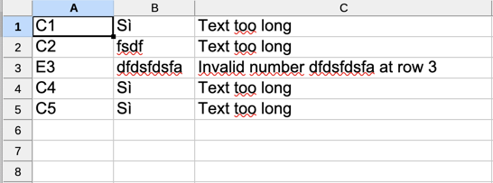

# Import Rows from csv, xls and xlsx

It is possible to start importing data from a csv, xls and xlsx file also from javascript server actions.

**Syntax**:

```javascript
utils.importRowsFromFile(
      Long dirId, 
      String fileName, 
      Long importId,
      boolean insert, 
      Long maxErrors, 
      Long maxRowErrors, 
      Map inputData, 
      Long destErrorsFileDirId, 
      String destErrorsFileName,
      boolean rollbackIfErrors 
);
```

<table>
  <thead>
    <tr>
      <th style="text-align:left">Argument</th>
      <th style="text-align:left">Description</th>
    </tr>
  </thead>
  <tbody>
    <tr>
      <td style="text-align:left">dirId</td>
      <td style="text-align:left">id of the directory where to search the file</td>
    </tr>
    <tr>
      <td style="text-align:left">fileName</td>
      <td style="text-align:left">file name</td>
    </tr>
    <tr>
      <td style="text-align:left">importId</td>
      <td style="text-align:left">id of import (*)</td>
    </tr>
    <tr>
      <td style="text-align:left">insert</td>
      <td style="text-align:left">true if you want insert the rows; false if you want insert or update the
        rows</td>
    </tr>
    <tr>
      <td style="text-align:left">maxErrors</td>
      <td style="text-align:left">
        <p>(optional) number of errors to block the reading of file.</p>
        <p>null: the file is read to the end</p>
        <p>1: reading of the file stops at the first error</p>
        <p>n: reading the file stops at error number n</p>
      </td>
    </tr>
    <tr>
      <td style="text-align:left">maxRowErrors</td>
      <td style="text-align:left">
        <p>(optional) number of errors to block the process of row</p>
        <p>null: the line is read completely even in case of errors</p>
        <p>1: processing of the line stops at the first error</p>
        <p>n: processing of the line stops at error number n</p>
        <p>when you reach the maximum number of errors for line, the line is discarded
          and you go to the next one</p>
      </td>
    </tr>
    <tr>
      <td style="text-align:left">inputData</td>
      <td style="text-align:left">(optional) map of variables or data to use to insert/update the rows</td>
    </tr>
    <tr>
      <td style="text-align:left">destErrorsFileDirId</td>
      <td style="text-align:left">(optional) id of the directory where saving the errors file</td>
    </tr>
    <tr>
      <td style="text-align:left">destErrorsFileName</td>
      <td style="text-align:left">(optional) name of errors file</td>
    </tr>
    <tr>
      <td style="text-align:left">rollbackIfErrors</td>
      <td style="text-align:left">true: if there are errors it cancels everything; false: confirms only
        the successfully imported rows</td>
    </tr>
  </tbody>
</table>

\(\*\) You can configure the import [here](https://4wsplatform.gitbook.io/user-guide/core-features/defining-the-ui/3-1-app-designer/3-1-24-bulk-import-binded-to-a-grid)

**Example**:

```javascript
utils.importRowsFromFile(
      9, 
      "example.xlsx", 
      9,
      true, 
      10, 
      2, 
      { "FIELD1": 123, "USERNAME": "TEST_USER" }, 
      9, 
      "errors_of_example.xlsx",
      true 
);
```

This is an example of errors file  
Column A: coordinate of error cell  
Column B: value in cell  
Column C: type of error



