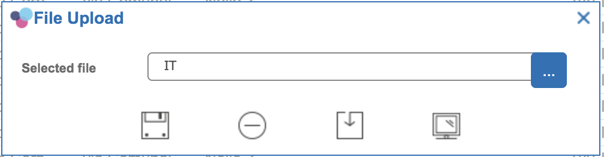

# Uploading files

The easiest way to upload files through platform is using the built-in functionalities available at grid and form level: you have just to define a "File path" or "File image" type column or control and bound to it a directory id and Platform will manage the rest. When showing a grid/form containing such a field, Platform will provide a standard popup window used to:

* upload a file
* download a file \(previously uploaded\)
* preview a file \(previously uploaded\)



In case you need more freedom when working with files to upload, there are additional javascript method available, described in the following sections.

## Upload a file, starting from an application event

Application events are linked to client-side javascript actions: you can listen to saving events, button click events or any other. You can use a client-side javascript action to invoke a built-in javascript function provided by Platform, through which you can manage a file upload.

**Syntax**

```text
uploadFile(
  title,
  enabled,
  fileName,
  dirId,
  beforeUploadCallback,
  afterUploadCallback,
  errorOnUploadCallback,
  additionalSettings
);
```

<table>
  <thead>
    <tr>
      <th style="text-align:left">Argument</th>
      <th style="text-align:left">Description</th>
    </tr>
  </thead>
  <tbody>
    <tr>
      <td style="text-align:left">title</td>
      <td style="text-align:left">Popup window title; you can define here a &quot;translation entry&quot;
        and set its translation for each supported language in the Translation
        functionality, by adding custom translations (Insert button) and fill in
        the Entry column with the same value reported here</td>
    </tr>
    <tr>
      <td style="text-align:left">enabled</td>
      <td style="text-align:left">true: upload button is enabled, false: upload button is disabled</td>
    </tr>
    <tr>
      <td style="text-align:left">fileName</td>
      <td style="text-align:left">file name to set in the input field; if it is not empty, then a &quot;Download&quot;
        and &quot;Preview&quot; buttons are shown too</td>
    </tr>
    <tr>
      <td style="text-align:left">dirId</td>
      <td style="text-align:left">directory id on the server side where saving the file to upload</td>
    </tr>
    <tr>
      <td style="text-align:left">beforeUploadCallback</td>
      <td style="text-align:left">
        <p>callback function invoked just before the uploading; format:</p>
        <p></p>
        <p>function({ fileName: &quot;...&quot; }) {</p>
        <p>return true|false</p>
        <p>}</p>
        <p></p>
        <p>false can block the uploading.</p>
        <p></p>
        <p>You can change the file name by working on the &quot;fileName&quot; argument</p>
      </td>
    </tr>
    <tr>
      <td style="text-align:left">afterUploadCallback</td>
      <td style="text-align:left">
        <p>callback function invoked after the uploading; format:</p>
        <p></p>
        <p>function({ fileName: &quot;....&quot;, success: true|false, message: &quot;...&quot;
          })</p>
        <p></p>
        <p>The popup window is automatically closed just before this callback is
          invoked</p>
      </td>
    </tr>
    <tr>
      <td style="text-align:left">errorOnUploadCallback</td>
      <td style="text-align:left">
        <p>callback function invoked in case of errors on uploading; format:</p>
        <p></p>
        <p>function({ error: &quot;...&quot; })</p>
        <p></p>
        <p>The popup window is automatically closed just before this callback is
          invoked</p>
      </td>
    </tr>
    <tr>
      <td style="text-align:left">additionalSettings</td>
      <td style="text-align:left">
        <p>contains an optional js object having the following attributes:</p>
        <p></p>
        <p>{</p>
        <p>encriptAttachments: true|false,</p>
        <p>panelId: ...</p>
        <p>}</p>
      </td>
    </tr>
  </tbody>
</table>

**Note**: this function can be invoked anywhere on the application UI; however, you cannot customize the content of the window, for example by adding additional input fields, specific to your UI. If you need to customize the upload popup window, you'd better use the next function.

## Upload a file, starting from a custom window

In case you need to customize completely the content of the popup window hosting your file to upload, you can define a Platform window containing a Platform Editable Panel, where you can include any type of input fields. The only constraint is to include also a **File Type Field**, available only with Editable Panels.

Such a special field is composed of a readonly text field containing the file name to upload and a button used to open the operating system file selection window to select the file to upload. These field provides CSS classes having this format:

> x-form-text x-form-field fileuploadfield-&lt;panelid&gt;-&lt;fielAttribute&gt; x-form-file-text x-form-invalid
>
> x-btn x-form-file-btn x-form-file-btn-fileuploadfield-&lt;panelid&gt;-&lt;fieldAttribute&gt; x-btn-noicon

The first CSS class can be used to customize the readonly text field, whereas the second one to customize the button.


Once setting up the popup window, you can add a component event to a button, in order to start the uploading process, through the **uploadFileFromForm** function. 

You can include in this process also additional information to pass forward to the server-side. More precisely, the upload process consists of:

* required input controls checking: in case there is one of more input fields declared mandatory and not filled, the process is interrupted and a warning message is prompted
* the selected file is sent to the server and saved in the specified directory id; at the same time, additional information is also passed forward to the server, where a server-side javascript action is invoked as long as the file has been saved and all input data is passed forward to this action

**Syntax**

```text
var ok = uploadFileFromForm(formPanel,actionId,dirId,settings,additionalSettings);
```

<table>
  <thead>
    <tr>
      <th style="text-align:left">Argument</th>
      <th style="text-align:left">Description</th>
    </tr>
  </thead>
  <tbody>
    <tr>
      <td style="text-align:left">formPanel</td>
      <td style="text-align:left">Editable panel variable (e.g. formPanelxxx), used to extract all input
        values</td>
    </tr>
    <tr>
      <td style="text-align:left">actionId</td>
      <td style="text-align:left">
        <p>id of the server-side javascript action to invoke; this action would receive
          in input all field values, through the &quot;vo&quot; input variable, where
          each field value is indexed by its attribute name:</p>
        <p>{</p>
        <p>inputfieldAttributeName1: &quot;....&quot;,</p>
        <p>inputfieldAttributeName2: &quot;....&quot;,</p>
        <p>...</p>
        <p>fileName: &quot;...&quot;, // original file name</p>
        <p>appId: &quot;...&quot;,</p>
        <p>actionId: ...,</p>
        <p>dirId: ...,</p>
        <p>type: &quot;FILE_PATH_FIELD&quot;,</p>
        <p>applicationId: &quot;...&quot;,</p>
        <p>unzip: &quot;N&quot;,</p>
        <p>optionalFileName: &quot;...&quot; // file name renamed</p>
        <p>}</p>
        <p></p>
      </td>
    </tr>
    <tr>
      <td style="text-align:left">dirId</td>
      <td style="text-align:left">directory id where the file must be saved; such a directory can be a Platform
        server directory or a bucket in GCS</td>
    </tr>
    <tr>
      <td style="text-align:left">settings</td>
      <td style="text-align:left">
        <p>optional: can be null; if set, it is a js object containing additional
          settings:</p>
        <p></p>
        <p></p>
      </td>
    </tr>
    <tr>
      <td style="text-align:left">additionalSettings</td>
      <td style="text-align:left">optional: can be null: if set, it contains pars/vals to pass forward to
        the server-side js action</td>
    </tr>
  </tbody>
</table>

Settings can contain something like:

<table>
  <thead>
    <tr>
      <th style="text-align:left">
        <p>settings: {</p>
        <p>autoDefineUploadFileName: true|false,</p>
        <p>// true to auto-rename file according to this policy: a.pdf -&gt; a_12345566.pdf</p>
        <p></p>
        <p>beforeUploadCallback: function({ filename: &quot;...&quot; ) {...},</p>
        <p>// callback used to define an ad hoc file renaming policy</p>
        <p></p>
        <p>afterUploadCallback: function({ success: true|false, message: &quot;...&quot;,
          fileName: &quot;...&quot; }) {...},</p>
        <p>// callback invoked at the end of the uploading process</p>
        <p></p>
        <p>errorOnUploadCallback: function({ error: &quot;...&quot; }) {...}</p>
        <p>// callback invoked in case of errors during the uploading process</p>
        <p>}</p>
      </th>
    </tr>
  </thead>
  <tbody></tbody>
</table>

Example of code which can be included in the client-side javascript action bound to a button click event, in order to start the uploading process:

```text
uploadFileFromForm(
    formPanelxxx, // Editor Panel variable
    yyy, // actionId
    zzz, // dir id
    {
        autoDefineUploadFileName: true
    },
    {
        myId: 123 // additional parameters to pass forward to the server side action
    }
);
```

## Download an uploaded file

Once a file has been uploaded, the easiest way to download it is through the grid/form panel from which it has been uploaded \(see first section in this web page\).

Anyway, it is possible to customize the download process and attach it in any part of the application UI, through the client-side javascript function provided by Platform:

```text
downloadFile(fileName,dirId)
```

You need to provide to this function the file name for the file to download and its location.

**Examples:**

```text
// in case of a grid having one file for each row
var selectedRow = gridxxx.getSelectionModel().getSelected();
var vo = selectedRow.data;
downloadFile(
  vo.fileName, // e.g. the attribute name containing the file name
  dirId // provided externally
);
```

```text
// in case of a form having a file linked to it
var record = formxxx.getForm().record;
downloadFile(
  record.fileName, // e.g. the attribute name containing the file name
  dirId // provided externally
);
```

**Note**: pay attention in case you are storing files in GCS; in such a scenario, the directory id only identifies the bucket name, not the relative path of the file, which must be saved along with the file name itself.

## Preview an uploaded file

Once a file has been uploaded, the easiest way to show it again is through the grid/form panel from which it has been uploaded \(see first section in this web page\).

Anyway, it is possible to customize the preview process and attach it in any part of the application UI, through the client-side javascript function provided by Platform:

```text
previewFile(fileName,dirId)
```

You need to provide to this function the file name for the file to download and its location.

**Examples:**

```text
// in case of a grid having one file for each row
var selectedRow = gridxxx.getSelectionModel().getSelected();
var vo = selectedRow.data;
previewFile(
  vo.fileName, // e.g. the attribute name containing the file name
  dirId // provided externally
);
```

```text
// in case of a form having a file linked to it
var record = formxxx.getForm().record;
previewFile(
  record.fileName, // e.g. the attribute name containing the file name
  dirId // provided externally
);
```

**Note**: pay attention in case you are storing files in GCS; in such a scenario, the directory id only identifies the bucket name, not the relative path of the file, which must be saved along with the file name itself.

**Note**: not all file formats can be showed as a preview; it depends on the browser plugins/extensions installed; it can work for most of the image formats, PDF \(if Acrobat reader has been installed\), text files, but it is unlikely that it can work for Office documents.


